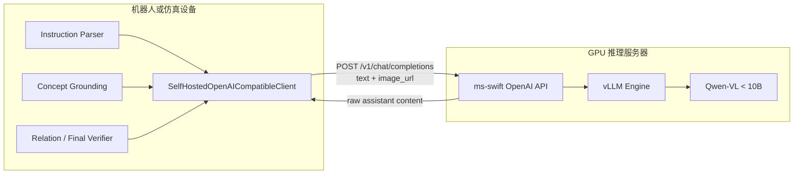

# VLN 自托管 LVLM 服务部署规范

## 1. 目的与边界

VLN 的 instruction parser、concept grounding、runtime concept matcher、
relation verifier 和 final verifier 都依赖结构化多模态推理。模型服务应独立于
Habitat 和 ROS2 运行时部署，以便服务器 GPU、机器人计算单元和仿真工作站分别
升级，而不改变导航语义合同。

服务端拥有：

- Qwen-VL 权重和视觉模板；
- `ms-swift` 推理引擎；
- vLLM 显存、并发和上下文配置；
- OpenAI-compatible HTTP 服务；
- 服务健康、吞吐和 GPU 指标。

VLN 客户端拥有：

- 各导航模块的 Pydantic response schema；
- schema prompt 注入和返回值校验；
- 调用类型、原始响应、延迟和失败日志；
- conservative fallback；
- 哪些推理结果具有候选排序、语义确认或 STOP 权限。

模型服务不得直接发布 ROS topic，也不得解释 waypoint 是否可达。机器人侧不得
依赖服务器本地图片路径，所有视觉输入统一使用 HTTP URL 或 base64 data URL。

## 2. 模型选择、获取与完整性校验


推荐使用与 `transformers`、`ms-swift` 和 vLLM 兼容的 Qwen-VL 指令模型。质量优先时
选择 7B 级别模型；显存受限时选择同系列的较小模型。实际模型 ID、来源和版本应记录
在部署环境的私有配置或发布清单中，不写入代码和公开文档。

### 2.1 在目标服务器准备模型

以下变量是部署参数，请按目标设备修改：

```bash
export VLN_ROOT=/opt/vln
export MODEL_ROOT=/models
export MODEL_ID=Qwen/Qwen2.5-VL-7B-Instruct
export MODEL_PATH="$MODEL_ROOT/Qwen2.5-VL-7B-Instruct"
```

可以通过组织内部模型仓库、受控对象存储或已批准的模型镜像获取模型。以 Hugging
Face 兼容下载工具为例：

```bash
mkdir -p "$MODEL_ROOT"
huggingface-cli download "$MODEL_ID" \
  --local-dir "$MODEL_PATH" \
  --local-dir-use-symlinks False
```

如果模型已由运维系统传输到服务器，直接使用该目录即可。目录必须保留完整的
`config.json`、tokenizer、processor、generation config、
`model.safetensors.index.json` 和其引用的全部 safetensors shard。

### 2.2 生成并保存模型清单

在源目录和目标目录分别执行以下命令：

```bash
python "$VLN_ROOT/deployment/lvlm_server/preflight.py" \
  --model "$MODEL_PATH" \
  --model-only \
  --sha256 \
  > "$MODEL_PATH.model-manifest.json"
```

清单至少应包含模型配置、索引引用的 shard 列表、每个 shard 的文件大小和 SHA256。
迁移验收时逐项比较 `weight_shards`、`weight_bytes` 和 `weight_sha256`；不能以缓存
目录存在、目录总大小或部分 shard 数量替代校验。模型清单应与部署回执一起归档，
不要提交到 Git。

## 3. 部署拓扑



推荐目录：

```text
$VLN_ROOT/                       VLN checkout
$VLN_ROOT/ms-swift/              ms-swift checkout
$MODEL_PATH/                     只读模型目录
/var/log/vln-lvlm/               服务日志
```

权重不写入 Git，也不固化进 VLN 的 ROS2 镜像。服务器镜像或环境只读挂载模型
目录；机器人容器只安装轻量 `openai` 和 `pydantic` 客户端依赖。

## 4. 服务端启动合同

在服务器使用独立 Python 环境，并在部署配置中固定经验证的 ms-swift tag 或 commit。
下面的 revision 是部署参数，不属于仓库默认值：

```bash
export VLN_ROOT=/opt/vln
export MS_SWIFT_ROOT="$VLN_ROOT/ms-swift"
export MS_SWIFT_REVISION=<approved-ms-swift-tag-or-commit>

git clone https://github.com/modelscope/ms-swift.git "$MS_SWIFT_ROOT"
git -C "$MS_SWIFT_ROOT" checkout "$MS_SWIFT_REVISION"

python3 -m venv "$VLN_ROOT/venvs/lvlm"
source "$VLN_ROOT/venvs/lvlm/bin/activate"
python -m pip install --upgrade pip
python -m pip install -e "$MS_SWIFT_ROOT"
python -m pip install vllm openai
```

CUDA、PyTorch 和 vLLM 版本必须针对目标服务器驱动选择，不能复制开发机 Python
环境。首次 API smoke 通过后保存 `pip freeze`、GPU 型号、驱动/CUDA 版本和 ms-swift
commit，作为该设备的部署基线。

配置模板位于：

```text
deployment/lvlm_server/model_profile.env.example
```

启动入口：

```bash
source /private/config/vln_lvlm.env
bash deployment/lvlm_server/run_server.sh
```

等价核心命令：

```bash
python3 -m swift.cli.deploy \
  --model "$MODEL_PATH" \
  --infer_backend vllm \
  --served_model_name "$SERVED_MODEL" \
  --host 0.0.0.0 \
  --port 8000 \
  --api_key "$VLN_LVLM_API_KEY" \
  --vllm_gpu_memory_utilization 0.85 \
  --vllm_max_model_len 8192 \
  --vllm_limit_mm_per_prompt '{"image":8,"video":0}' \
  --max_new_tokens 1024
```

`MAX_PIXELS` 同时限制视觉 token 和网络负载。机器人发送图片前仍应执行已有的
resize/padding，避免把完整全景原图重复上传给只需要对象 crop 的 verifier。

## 5. HTTP 接口

服务至少提供：

| 方法 | 路径 | 用途 |
|---|---|---|
| GET | `/health` | 推理引擎 readiness |
| GET | `/v1/models` | served model name 校验 |
| POST | `/v1/chat/completions` | 文本和多图推理 |

VLN 实际请求形式：

```jsonc
{
  "model": "<served-model-name>",
  "messages": [
    {
      "role": "system",
      "content": "任务 prompt + JSON schema"
    },
    {
      "role": "user",
      "content": [
        {
          "type": "image_url",
          "image_url": {"url": "data:image/jpeg;base64,..."}
        },
        {
          "type": "text",
          "text": "候选、原始指令、几何事实和 ledger 上下文"
        }
      ]
    }
  ],
  "temperature": 0,
  "max_tokens": 1024
}
```

API key 只通过环境变量或 secret mount 提供，不写入脚本、文档、Docker image 或
运行产物。跨主机部署使用私有网络、VPN 或 TLS reverse proxy，不能将裸 8000
端口暴露到公网。

## 6. 机器人侧 HTTP 调用实现

机器人容器不加载 Qwen 权重，也不需要安装 vLLM。选择 `self_hosted` 后，
`llm_utils.cognav_llm_adapter.get_client_and_model()` 构造
`SelfHostedOpenAICompatibleClient`，其内部通过 OpenAI-compatible HTTP 客户端向
远端 `POST /v1/chat/completions` 发送文本或 base64 图像。调用方仍使用项目内部的
`client.beta.chat.completions.parse(...)` 形状，因此 parser、concept matcher、
relation verifier 和 final verifier 不感知网络传输细节。

推荐配置：

```bash
export LLM_PROVIDER=self_hosted
export VLN_LVLM_BASE_URL=http://<lvlm-server>:8000/v1
export VLN_LVLM_API_KEY=<private-server-token>
export VLN_LVLM_MODEL=<served-model-name>
```

兼容配置 `STRIVE_LVLM_BASE_URL`、`STRIVE_LVLM_API_KEY`、`STRIVE_LVLM_MODEL` 仍然
有效。配置优先级和消息合同由 `HttpVlmSettings` 统一维护，避免在各个 verifier
里重复读取环境变量。正式接入前依次运行 `/health`、`/v1/models` 和五个生产 schema
的 HTTP smoke；只有 schema smoke 通过，才认为远端服务可被导航模块消费。

## 7. 结构化输出适配

VLN 现有调用方依赖：

```python
completion = client.beta.chat.completions.parse(
    model=model,
    messages=messages,
    response_format=ParsedResult,
    trace_label="final_instruction_verifier",
)
result = completion.choices[0].message.parsed
```

当前 `ms-swift` API 支持普通 chat completions，但没有完整实现 OpenAI
`beta.parse` 的 `response_format=json_schema` 合同。为保持模型服务通用，
`SelfHostedOpenAICompatibleClient` 在客户端完成：

```text
Pydantic schema
  -> 注入 system prompt
  -> 普通 chat.completions.create
  -> 提取唯一 JSON object
  -> Pydantic 严格校验
  -> 最多一次 schema repair
  -> 仍失败则 conservative fallback
```

核心安全约束：

```text
transport / parse / validation failure
  -> satisfied = false
  -> decision = uncertain 或等价保守状态
  -> 不得产生 final STOP
```

原始响应和每次 repair 调用都进入 `lvlm_call_tracker`，但 prompt 中的大图 base64
不写日志。

## 8. 客户端配置

机器人或仿真运行环境配置：

```bash
export LLM_PROVIDER=self_hosted
export STRIVE_LLM_CLIENT=self_hosted
export STRIVE_VLM=self_hosted
export STRIVE_INSTRUCTION_PLAN_BACKEND=llm
export STRIVE_LVLM_BASE_URL=http://LVLM_SERVER:8000/v1
export STRIVE_LVLM_API_KEY=<private-token>
export STRIVE_LVLM_MODEL=<served-model-name>
export STRIVE_LVLM_TIMEOUT_S=45
export STRIVE_LVLM_TRANSPORT_RETRIES=2
export STRIVE_LVLM_PARSE_RETRIES=1
```

新部署配置也可以使用以下 preferred VLN 别名；二者不应同时设置不同的值：

```bash
export VLN_LVLM_BASE_URL=http://LVLM_SERVER:8000/v1
export VLN_LVLM_API_KEY=<private-token>
export VLN_LVLM_MODEL=<served-model-name>
```

`LLM_PROVIDER=ark` 与 `self_hosted` 是 provider 配置，不应散落为 parser、matcher、
verifier 内部条件。所有上层模块继续通过 `get_client_and_model()` 获取统一客户端。
Docker 实物入口按 `STRIVE_VLM > STRIVE_LLM_CLIENT > LLM_PROVIDER > cognav` 解析
provider；直接调用 ROS2 launch 时需要显式传入 `vlm:=self_hosted`。

## 9. 验收分层

### 9.1 静态 preflight

- `config.json` 和 tokenizer/processor 文件存在；
- weight index 引用的 shard 全部存在且非空；
- `swift`、`transformers`、`vllm`、`torch` 可导入；
- CUDA 可见，模型与运行库版本兼容。

### 9.2 API smoke

```bash
python deployment/lvlm_server/smoke_client.py \
  --base-url http://LVLM_SERVER:8000/v1 \
  --model "$VLN_LVLM_SERVED_MODEL" \
  --api-key "$VLN_LVLM_API_KEY" \
  --image /path/to/frame.jpg
```

### 9.3 VLN schema smoke

从 VLN 侧使用一张具有代表性的导航 RGB 帧执行生产 schema 验收：

```bash
python -m deployment.lvlm_server.schema_smoke \
  --base-url http://LVLM_SERVER:8000/v1 \
  --model "$VLN_LVLM_SERVED_MODEL" \
  --api-key "$VLN_LVLM_API_KEY" \
  --image /path/to/navigation_frame.jpg \
  --output artifacts/lvlm_schema_smoke_receipt.json
```

该命令依次调用生产环境正在使用的 prompt、Pydantic schema 和 trace label：

- `instruction_parser`；
- `concept_grounding`；
- `concept_match_batch`；
- `relation_verifier`；
- `final_instruction_verifier`。

回执 schema 为 `strive.lvlm_schema_smoke_receipt/v1`，保存每次调用的耗时、原始响应、
本地解析结果和语义不变量检查结果。最终验证用例故意令
`hard_stop_constraints.satisfied=false`；模型若返回 `satisfied=true` 或
`decision=accept`，整体验收必须失败。只有进程退出码为 `0` 且回执
`success=true` 时，才能认为服务满足 VLN 的结构化接口合同。

### 9.4 目标服务器正式验收

在目标 GPU 服务器的 VLN 仓库根目录运行统一验收器：

```bash
python -m deployment.lvlm_server.accept_deployment \
  --model-path "$MODEL_PATH" \
  --ms-swift-root "$MS_SWIFT_ROOT" \
  --expected-ms-swift-revision "$MS_SWIFT_REVISION" \
  --base-url http://127.0.0.1:8000/v1 \
  --served-model "$VLN_LVLM_SERVED_MODEL" \
  --api-key "$VLN_LVLM_API_KEY" \
  --image /path/to/navigation_frame.jpg \
  --sha256 \
  --output artifacts/lvlm_deployment_acceptance.json
```

回执 schema 为 `strive.lvlm_deployment_acceptance/v1`，通过条件是以下阶段全部成功：

```text
clean pinned ms-swift checkout
complete model snapshot and shard SHA256
CUDA and serving dependency preflight
/health and /v1/models
five production structured schemas
```

验收器会拒绝 dirty 或 revision 不匹配的 ms-swift checkout。服务启动和正式验收必须
使用同一 `--ms-swift-root`，不能只检查一个干净副本、却从另一个工作区加载服务代码。

### 9.5 性能验收

记录每个 trace label 的：

```text
request count
cache hits
input image count and encoded bytes
prompt/completion tokens
p50 / p95 latency
timeout and schema-repair rate
GPU memory and utilization
```

模型服务上线的最低条件不是“端口可访问”，而是五类结构化调用全部通过且失败路径
保持保守，并保留正式验收回执。GPU 加载、吞吐和延迟必须在实际部署目标上完成验收。
