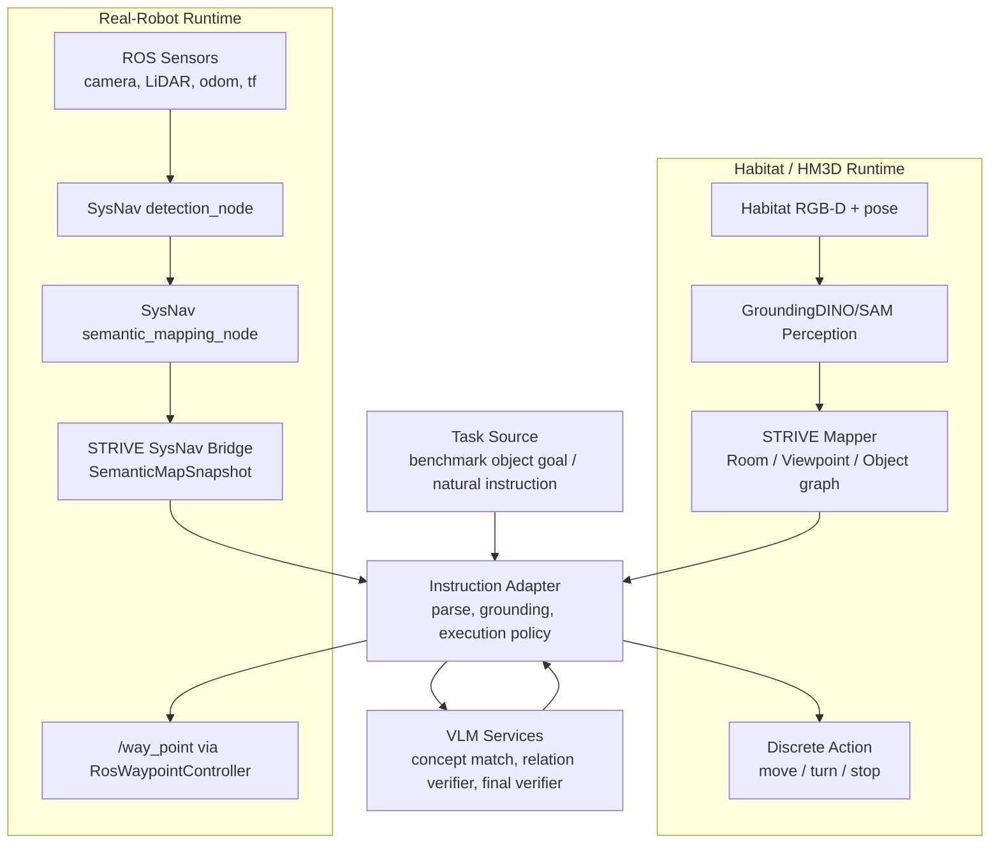
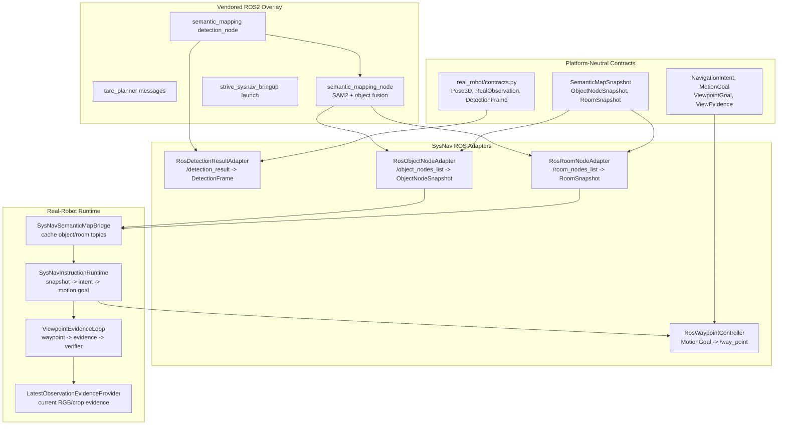
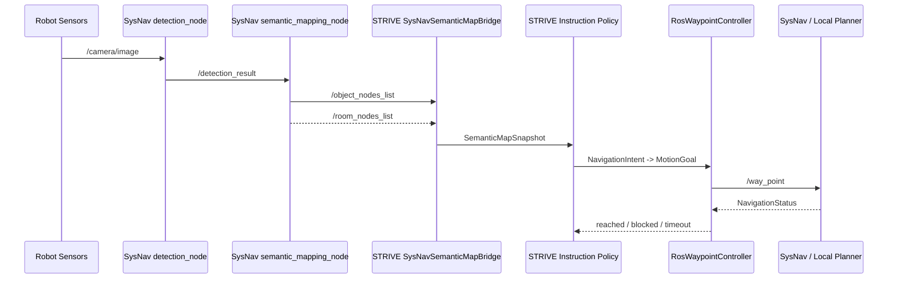
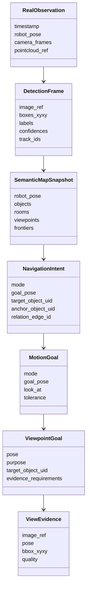

# STRIVE-CogNav Object Navigation 技术白皮书

项目 pipeline 示意图：


## 1. 系统定位

Object Navigation 的难点并不止于检测某个类别。智能体需要在未知环境中持续
积累观测、判断已经探索过哪些区域、推断目标更可能出现在哪里，并在发现候选目标后
决定是否足以停止。VLM 为这一问题提供了常识和上下文理解能力，但直接让 VLM 面对
逐帧图像或所有 frontier 候选，会把局部视觉判断、三维空间推理和运动控制混在一起。

本项目在 Habitat HM3D / HM3D-OVON benchmark 中实现 open-vocabulary object
navigation，并扩展了面向复杂自然语言任务的 instruction adapter。系统设计沿用
Zhu et al. (2025) 的基本判断：VLM 不应替代导航系统，而应在结构化场景表示上承担
恰当粒度的语义推理。其核心目标不是把 VLM 放到每一步动作决策里，而是将其限制在
更合适的语义层级：

```text
传感器观测
  -> 目标检测与分割
  -> 三层结构化场景图
  -> 指令解析与概念 grounding
  -> 房间级/对象级语义推理
  -> 局部路径与视角控制
  -> final verifier 判断是否 STOP
```

STRIVE 的关键贡献在于用 `Room / Viewpoint / Object` 三层结构压缩历史观测。
object node 保留目标定位与语义线索，viewpoint node 将连续空间离散成可探索的关键
位置，room node 则为跨房间规划提供更稳定的推理单位。这样，VLM 面对的是经过组织的
环境摘要，而不是未经筛选的长轨迹图像序列。SysNav 进一步强调系统分层：高层语义推理、
中层导航规划、低层运动控制分别承担不同职责，避免将空间一致性和运动安全交给 VLM。

本项目当前实现遵守同一原则：

- VLM/LLM 负责语义编译、概念匹配、关系验证和最终停止判断。
- 几何建图、前沿探索、路径规划和动作执行由确定性模块完成。
- 动态语义边按需计算，避免为所有物体对建立稠密关系图。
- benchmark object-goal 与自然语言 instruction mode 共享 final verifier
  和 view-control 闭环，但 benchmark 的结构化目标不会被复杂自然语言语义污染。

因此，本文中的“STRIVE-CogNav”不是对原论文的简单工程复现。它保留了 STRIVE 的
多层场景表示和两阶段导航思想，同时加入面向自然语言任务的指令编译、运行时概念
grounding、动态语义关系边和实物 ROS 适配层。设计目标是让语义能力扩展到更复杂的
指令，同时不破坏原方法中“结构化表示约束 VLM 使用范围”的核心原则。

## 2. 任务形式化

ObjectNav 中，智能体在未知室内环境中寻找目标物体实例。时间步 `t` 的观测为：

$$
O_t = \{I_t, D_t, P_t\}, \quad P_t = \langle p_t, R_t \rangle
$$

其中 `I_t` 为 RGB 图像，`D_t` 为深度图或由点云投影得到的深度，`P_t`
为相机位姿。动作空间在仿真中为离散动作：

$$
a_t \in \{\text{move\_forward}, \text{turn\_left}, \text{turn\_right}, \text{stop}\}
$$

真实机器人中，动作输出被替换为中层 waypoint 或 navigation intent，再由
底层控制器转成连续速度：

$$
u_t = (v_x, v_y, \omega)
$$

传统 object-goal benchmark 的成功条件为：

$$
\text{Success} =
\mathbb{1}\left[
a_t = \text{stop}
\land d(p_t, \mathcal{G}) \le d_s
\land t \le T
\right]
$$

其中 `\mathcal{G}` 是目标实例集合，`d_s` 是 benchmark 指定的停止距离。
本项目在该条件外增加 instruction-level final verifier：

$$
\text{Accept} =
\text{semantic\_satisfied}
\land \text{constraints\_satisfied}
\land \text{view\_sufficient\_for\_stop}
$$

对于普通 benchmark，原始指令被编译为结构化目标，例如 `Find the <tv>.`；
对于自然语言任务，原始指令可能包含属性、房间、数量、顺序或空间关系。

## 3. 总体框架

### 3.1 分层架构

整体框架遵循“表示先于推理”的原则。原始观测首先被整理为对象、视点和房间组成的
场景图；VLM 只在该表示不足以由确定性模块完成决策时被调用。例如，房间选择需要
常识和语义关联，目标确认需要上下文视觉理解，空间关系约束需要按需验证；而可通行性、
距离、路径执行和底层安全停止仍由几何与控制模块负责。

```text
+---------------------------------------------------------------+
| User / Benchmark Task                                         |
|   object_category=tv | instruction="I want to watch movie"     |
+------------------------------+--------------------------------+
                               |
                               v
+---------------------------------------------------------------+
| Instruction Adapter                                            |
|   parse -> concept grounding -> execution policy -> constraints|
+------------------------------+--------------------------------+
                               |
                               v
+---------------------------------------------------------------+
| Perception and Mapping                                         |
|   RGB-D / point cloud -> detection -> masks -> objects         |
|   viewpoint graph -> room graph -> semantic edges              |
+------------------------------+--------------------------------+
                               |
                               v
+---------------------------------------------------------------+
| Planning and Navigation                                        |
|   target selection -> room/frontier exploration -> path         |
|   final verifier -> view-control -> STOP or continue           |
+------------------------------+--------------------------------+
                               |
                               v
+---------------------------------------------------------------+
| Runtime Adapter                                                |
|   Habitat discrete action | Real robot waypoint/cmd bridge     |
+---------------------------------------------------------------+
```

从工程实现看，当前代码已经将仿真 runtime 与实物 runtime 分成两条边界清晰的
执行链路。二者共享指令解析、concept grounding、关系验证和 final verifier；
差异只存在于观测来源、地图写入方和运动执行接口。



## 4. 指令解析模块

### 4.1 设计原则

指令解析模块是任务编译层，不是导航策略层。它只回答五个问题：

1. 用户要找什么。
2. 哪些约束必须满足。
3. 哪些目标可以终止任务。
4. 哪些对象只是上下文或 anchor。
5. 哪些约束需要运行时验证。

它不编码“TV 常在客厅”“杯子常在桌上”这类常识表。常识可以由 LLM 在
prompt 中生成 search priors，或由 room selection prompt 在运行时使用，但
不能静默写入 parser 规则。

### 4.2 Canonical schema

指令被编译为 `InstructionPlan`：

```python
InstructionPlan:
    raw_instruction: str
    dataset_target: str
    task_type: str
    eval_mode: str
    targets: list[TargetQuery]
    constraints: list[Constraint]
    search_priors: SearchPriors
    execution: ExecutionPolicy
    concept_queries: list[ConceptQuery]
    valid: bool
    diagnostics: dict
```

目标、anchor 和支持物统一表达为 `ConceptQuery`：

```python
ConceptQuery:
    id: str
    name: str
    role: primary | anchor | support | secondary
    detector_terms: list[str]
    aliases: list[str]
    description: str
    negative_terms: list[str]
    terminal: bool
```

只有 `terminal=True` 的 concept 可以触发最终成功。anchor 和 support 只能用于
搜索、关系验证或局部扫描，不能让 episode stop。

约束为声明式结构：

```python
Constraint:
    type: room | spatial | sequence | count | attribute | area | co_occurrence
    subject: str
    relation: str
    object: str
    hardness: hard | soft
    verifier: planner | geometry | vlm | metadata
```

parser 只声明约束，不验证约束。运行时由 `ConstraintEvaluator` 根据
`verifier` 选择几何、VLM、metadata 或执行状态机处理。

### 4.3 编译过程

令自然语言指令为 `x`，可用检测类别集合为 `C_det`，episode metadata 为 `M`。
指令编译可写为：

$$
\mathcal{P} =
\begin{cases}
f_{\text{meta}}(M), & M \text{ contains structured task fields} \\
f_{\text{LLM}}(x, C_{\text{det}}), & \text{otherwise}
\end{cases}
$$

其中 `\mathcal{P}` 即 `InstructionPlan`。随后进行 detector grounding：

$$
g(q, C_{\text{det}}) \rightarrow
\{\text{detector\_terms}, \text{aliases}, \text{negative\_terms}, \text{description}\}
$$

`q` 是 `ConceptQuery`。grounding 结果写入 `plan.json`，不再通过代码中隐藏的
同义词表实现。

### 4.4 Runtime concept matching

编译期 concept 不是运行时 object label。mapper 发现对象实例 `o_i` 后，需要
判断它是否满足 concept `q_j`：

$$
m(q_j, o_i, I, r) \rightarrow
(\text{match}, \text{confidence}, \text{role}, \text{reason})
$$

其中 `I` 是原始指令，`r` 是 concept role。匹配结果按
`(instruction_hash, concept_id, object_uid)` 缓存，避免同一对象反复调用 VLM。

重要区分：

```text
terminal match:
  可作为 final verifier 候选

anchor/support match:
  只能作为搜索参考或 relation verifier 的 anchor
```

### 4.5 支持的任务子集

当前 schema 与执行状态支持：

- 单目标：`find a chair`
- 隐式功能目标：`I want to watch movie`
- 属性目标：`red couch`
- 房间约束：`chair in bedroom`
- 多目标任一成功：`find a chair or sofa`
- 顺序任务：`first find the bed, then the towel`
- 数量任务：`find all chairs` 或 `find three chairs`
- 空间关系：`book on shelf`, `cup near table`, `object inside cabinet`
- anchor-first relation search：先找 anchor 区域，再局部搜索 terminal object

### 4.6 伪代码：指令编译

```text
Algorithm CompileInstruction
Input:
  raw_instruction x
  episode_metadata M
  detector_classes C_det
Output:
  InstructionPlan P

# 先把任务编译成声明式计划；这里不读取地图，也不决定机器人往哪里走。
1: if M contains structured task fields then
#     数据集已有结构化目标时优先使用 metadata，减少不必要的 LLM 解析误差。
2:     P <- parse_metadata(M)
3: else
#     没有 metadata 时才调用 LLM；LLM 只抽取目标、角色和约束，不注入场景经验。
4:     P <- LLM_parse(x, C_det)
5: end if
6: for each target or constraint concept q in P do
#     grounding 层负责把自然语言概念对齐到 detector 词表，避免 parser 内部硬编码 alias。
7:     q' <- concept_grounding(q, C_det)
8:     write q' back to P
9: end for
# 根据 plan 的结构选择执行模式，例如单目标、anchor-first、count 或 sequence。
10: P.execution <- choose_execution_strategy(P)
# terminal 与 anchor 必须显式隔离；anchor 只能辅助搜索，不能触发 STOP。
11: validate terminal/anchor roles
# 落盘 plan.json，保证每次导航的语义编译过程可追踪、可复现。
12: persist P as plan.json
13: return P
```

### 4.7 Prompt 样例：指令解析

```text
You are a semantic compiler for indoor object navigation instructions.

Return strict JSON. Do not solve navigation and do not invent scene-specific
facts. Extract only what the user asks for:
- targets: object concepts mentioned or implied by the instruction.
- terminal=true only for objects that may satisfy the final goal.
- anchors/support objects must be terminal=false.
- constraints: room, spatial, sequence, count, attribute, co_occurrence.
- Do not encode common-sense priors such as "TV is in living room" unless
  the room or context is explicitly stated by the instruction.

Instruction:
  "find a book on a shelf"

Expected structure:
  terminal target: book
  anchor/support concept: shelf
  hard spatial constraint: book on shelf, verifier=vlm
```

### 4.8 Prompt 样例：概念 grounding

```text
You map an instruction target concept to detector vocabulary.

Concept:
  name: shelf
  role: anchor
  instruction: find a book on a shelf

Available detector classes:
  [book, cabinet, bookshelf, table, chair, wall, ...]

Return JSON:
{
  "detector_terms": ["bookshelf", "cabinet", "shelf"],
  "aliases": ["bookcase", "shelving"],
  "description": "storage furniture or shelf-like structure that can hold books",
  "negative_terms": ["book", "table surface"],
  "terminal": false
}
```

这里的 `bookshelf/cabinet` 不是硬编码同义词，而是本次指令、本次 detector
vocabulary 和 role 共同作用下的显式 grounding 产物。

## 5. 建图模块

建图模块的目标不是追求完整的几何重建，而是维护一个对导航决策足够紧凑、可解释且
可持续更新的状态表示。STRIVE 论文的核心观察是：VLM 对局部图像和语义关联较强，
但对连续三维路径、历史轨迹和长程空间一致性的把握并不稳定。因此，地图层需要先把
原始 RGB-D 或点云观测组织成结构化证据，再交给 VLM 做高层判断。

### 5.1 输入与坐标系

仿真输入为 posed RGB-D：

```python
Observation:
    rgb: H x W x 3
    depth: H x W x 1
    pose: SE3
```

真实机器人计划输入为 RGB/panorama、LiDAR point cloud、SLAM pose 和相机外参。
内部统一为局部地图坐标：

$$
X_c = D(u,v) K^{-1}
\begin{bmatrix}
u \\ v \\ 1
\end{bmatrix},
\qquad
X_w = R_t X_c + p_t
$$

其中 `K` 是相机内参，`X_c` 是相机坐标下点，`X_w` 是地图坐标下点。

### 5.2 视觉检测与分割

当前 benchmark pipeline 使用 GroundingDINO + SAM：

```text
RGB image + text prompts
  -> GroundingDINO boxes
  -> SAM masks
  -> mask + depth back-projection
  -> object point clouds
```

对第 `i` 个 mask：

$$
\mathcal{P}_i =
\left\{
T_t \left(
D(u,v)K^{-1}[u,v,1]^T
\right)
\mid (u,v) \in M_i
\right\}
$$

对象节点属性为：

$$
A(v_i^o) =
\{c_i, conf_i, \mathcal{P}_i, bbox_i, I_i, \phi_i\}
$$

其中 `\phi_i` 表示按需推理得到的颜色、材质、功能等属性。

### 5.3 三层场景图

场景表示为：

$$
\mathcal{R} = (\mathcal{V}, \mathcal{E})
$$

节点分为三类：

$$
\mathcal{V}
= \mathcal{V}^{room}
\cup \mathcal{V}^{vp}
\cup \mathcal{V}^{obj}
$$

边分为：

$$
\mathcal{E}
= \mathcal{E}^{r-r}
\cup \mathcal{E}^{r-v}
\cup \mathcal{E}^{r-o}
\cup \mathcal{E}^{v-v}
\cup \mathcal{E}^{v-o}
\cup \mathcal{E}^{o-o}
$$

三类节点分别服务于不同粒度的决策：

- `Room node`：跨房间规划单位，承载房间内对象、探索状态和到达代价。
- `Viewpoint node`：离散化的探索位置，连接前沿、对象和房间，是低层覆盖探索的骨架。
- `Object node`：物体实例及其语义、点云、bbox、代表图像和验证状态。

这种分层并不是简单增加图节点数量，而是为了把不同性质的问题放到正确的尺度上：
目标是否更可能在某个房间出现，是 room-level 语义问题；下一步去哪个 frontier，
是 viewpoint-level 几何覆盖问题；某个检测框是否真的是目标，则是 object-level
视觉验证问题。

### 5.4 Viewpoint construction

每个 viewpoint 控制半径为 `\zeta_{cover}` 的区域：

$$
C(v_i^{vp}) =
\{x \in \mathbb{R}^2 \mid \|x - p_i\|_2 \le \zeta_{cover}\}
$$

累计覆盖区域：

$$
C_{\text{prev}} = \bigcup_{v_i^{vp} \in \mathcal{R}} C(v_i^{vp})
$$

若当前观测带来足够新覆盖：

$$
|C_t \setminus C_{\text{prev}}| > \epsilon
$$

则添加新的 viewpoint node。对于有 frontiers 的区域，先聚类 frontier edge
segments，再以 clique 或聚类中心生成候选 viewpoint；对于无 frontier 的区域，
以连通区域中心作为候选。

### 5.5 Object association

新对象点云 `\mathcal{P}_j` 与已有对象 `\mathcal{P}_i` 是否合并，依据类别、
空间距离、点云重叠和历史置信度综合判断。抽象形式为：

$$
\text{merge}(i,j) =
\mathbb{1}\left[
s_c(c_i,c_j)
\lambda_o s_o(\mathcal{P}_i,\mathcal{P}_j)
\lambda_d e^{-\|p_i-p_j\|_2}
> \tau_m
\right]
$$

其中 `s_c` 为类别/概念一致性，`s_o` 为空间重叠或邻近度，`\tau_m` 为合并阈值。
instruction mode 中还会利用 instance ledger 避免被明确拒绝的实例反复成为候选。

### 5.6 Room segmentation

房间分割遵循 STRIVE/SysNav 的结构化思想：墙体或障碍区域将可通行空间分割为
连通区域，每个区域形成 `room node`。实际实现中由
`mapping/room_segmenter.py` 承接主要逻辑，并在失败时回退为单房间模式，避免
room segmentation 异常破坏导航主循环。

需要注意，当前代码不是论文附录中完整的
`top-down histogram -> wall mask -> background dilation -> room seeds -> watershed`
流程。工程实现更保守，主要步骤是：

```text
scene point cloud + navigable point cloud
  -> height filtering and voxel down-sampling
  -> project to top-down 2D histogram
  -> threshold + morphology closing to estimate wall skeleton
  -> build whole-scene/free-space mask from full point cloud projection
  -> remove wall pixels from free-space mask
  -> connected components on the remaining free space
  -> assign navigation nodes to connected room regions
  -> fallback to a single temporary room if regions are empty
```

也就是说，当前实现使用 connected component markers 作为最终 room region 来源，
没有继续执行 watershed 的 `-1` 边界语义。代码中保留这一取舍是为了提高早期探索阶段
的稳定性：当点云稀疏、墙体骨架不完整或 marker 为空时，系统会先回退到单房间，
而不是让 relocation 或 room policy 崩溃。论文中的背景逐步膨胀与 watershed 分割可以
作为后续增强方向，但当前 benchmark 路径并未完整采用该流程。

房间节点属性：

$$
A(v_i^r) = \{m_i^r, c_i^r, I_i^r, \mathcal{O}_i, \mathcal{V}_i^{vp}\}
$$

其中 `m_i^r` 是 top-down room mask，`c_i^r` 是可选 room category，
`I_i^r` 是代表视图，`\mathcal{O}_i` 是房间内对象集合。

### 5.7 动态语义边

SysNav 的关键思想是 object-object 关系边按需计算，而不是对所有对象对建立稠密图。
对于关系约束：

```text
book on shelf
```

设候选 book 为 `v_i^o`，anchor shelf 为 `v_j^o`。共同观察过两者的 viewpoint
集合为：

$$
\mathcal{V}_{i,j} =
\{v_k^v \mid e_{k,i}^{v-o} \in \mathcal{R}
\land e_{k,j}^{v-o} \in \mathcal{R}\}
$$

系统从这些 viewpoint 中取代表图像或 check_again 图像，让 VLM 判断关系 `\varphi`
是否成立：

$$
h_{\text{VLM}}(I_k, v_i^o, v_j^o, \varphi)
\rightarrow
(\text{verified}, conf, reason)
$$

若成立，则添加动态边：

$$
e_{i,j}^{o-o} \in \mathcal{E}^{o-o},
\qquad
A(e_{i,j}^{o-o}) = \{\varphi, conf, evidence\}
$$

关系失败只拒绝该对象对，不拒绝对象类别：

```text
reject(book_uid, shelf_uid, on)
  != reject(book)
  != reject(shelf)
```

这保证了“找红色椅子看到蓝色椅子”或“book 不在当前 shelf 上”时，系统不会屏蔽
整个 chair/book 类别，也不会无限回到同一个错误实例。

### 5.8 伪代码：地图更新

```text
Algorithm UpdateStructuredMap
Input:
  observation O_t = {I_t, D_t, P_t}
  detector prompts Q
  current map R
Output:
  updated map R

# 地图更新只维护结构化证据；是否满足任务由后续 planner/verifier 判断。
1: boxes, labels, scores <- Detector(I_t, Q)
# 分割 mask 用于从 2D 检测恢复 3D object evidence，而不是直接作为最终目标确认。
2: masks <- Segmenter(I_t, boxes)
3: for each detection i do
#     将检测 mask 反投影到世界坐标，得到可被几何模块使用的对象点云。
4:     P_i <- BackProject(mask_i, D_t, P_t)
#     object node 记录类别、置信度、bbox、点云和代表图像引用。
5:     o_i <- BuildObjectNode(P_i, label_i, score_i, bbox_i)
#     合并只处理同一物理实例的关联；被 verifier 拒绝的是实例或对象对，不是整个类别。
6:     MergeOrInsertObject(R, o_i)
7: end for
# 更新可通行几何，为 frontier、拓扑边和停止距离提供硬约束依据。
8: UpdateNavigablePointCloud(R, D_t, P_t)
# viewpoint 是探索骨架；优先覆盖新 frontier，避免每一步都让 VLM 评估低层动作。
9: UpdateViewpointNodes(R, current_pose, frontier_clusters)
# 拓扑边只表达可达性和可见性，不承担语义判断。
10: UpdateTopologyEdges(R)
# room segmentation 为跨房间推理提供上层单位；失败时应回退而不是中断导航。
11: SegmentOrUpdateRooms(R)
# 建立 room-viewpoint-object 关联，让 VLM 看到压缩后的结构化上下文。
12: UpdateRoomObjectViewpointEdges(R)
# debug artifact 是离线分析材料，不应反向影响 runtime 状态。
13: Persist debug artifacts if enabled
14: return R
```

## 6. 导航策略模块

### 6.1 两阶段策略

STRIVE 的导航策略可以概括为两阶段。第一阶段在房间层面调用 VLM，利用目标语义、
房间对象、探索状态和行程代价选择下一片搜索区域；第二阶段在房间内部采用传统
frontier/viewpoint 探索，并只在需要早停或确认目标时调用 VLM。这样既利用了 VLM 的
常识推理能力，又避免让它在每个低层候选点上承担三维路径评估。

1. 高层：VLM 在 room-level 选择下一探索区域。
2. 低层：传统 frontier/viewpoint 方法在房间内部覆盖探索。

本项目在此基础上增加 instruction-aware target selection、anchor-first relation
search、final verifier 与 view-control。

### 6.2 目标选择

对象候选来自 mapper 的 object nodes。候选过滤顺序为：

```text
object nodes
  -> detector/alias/concept matching
  -> instance rejection ledger
  -> room/attribute/relation/count/sequence constraints
  -> terminal target candidate
```

对于 benchmark object-goal，目标被转换为窄指令：

```text
object_category=tv
  -> InstructionPlan(raw_instruction="Find the <tv>.")
```

这使 benchmark 和自然语言任务共用同一 final verifier 与 ledger 机制。

### 6.3 Room-level planning

在当前房间探索结束但未找到目标时，系统需要选择下一房间。抽象 room utility：

$$
U(r_i \mid g, \mathcal{R})
=
\alpha S_{\text{sem}}(r_i, g)
+ \beta S_{\text{frontier}}(r_i)
- \gamma \tilde{d}(p_t, r_i)
- \eta B(r_i)
$$

其中：

- `S_sem`：房间对象、caption、功能语义与目标的相关性。
- `S_frontier`：房间剩余探索价值。
- `\tilde{d}`：考虑已走步数和回溯惩罚的路径代价。
- `B(r_i)`：已失败或低价值房间的惩罚项。

论文中的 STRIVE 让 VLM 综合语义相关性与 travel cost，而不是逐个评估所有
viewpoint。这个设计有两个直接收益：其一，房间摘要比单帧图像更接近人类进行室内
搜索时使用的上下文；其二，room-level 决策显著降低了 VLM 调用频率和 token 消耗。
SysNav 进一步强调将 VLM 限制在 room-level，以避免其进行细粒度 3D 路径判断。

### 6.4 In-room exploration

房间内部探索主要依赖 frontier 和 viewpoint graph。候选 viewpoint 的价值可写为：

$$
S(v_i^{vp})
=
\lambda_f F(v_i^{vp})
+ \lambda_c C_{\text{novel}}(v_i^{vp})
+ \lambda_o O_{\text{relevance}}(v_i^{vp})
- \lambda_d d(p_t, v_i^{vp})
$$

其中 `F` 表示 frontier 价值，`C_novel` 表示新覆盖区域，`O_relevance`
表示可见对象与任务的相关性。

### 6.5 Anchor-first relation search

对小目标或关系任务，直接等待 detector 发现 terminal object 往往效率低。例如：

```text
find a book on a shelf
```

理想执行过程：

```text
terminal concept: book
anchor concept: shelf
relation: on

1. concept matcher 找到 shelf-like anchor。
2. agent 导航到 anchor 附近。
3. 局部扫描 terminal concept book。
4. 对 book-anchor pair 做 relation verifier。
5. final verifier 用原始指令确认。
```

anchor 不参与 stop。若某个 anchor 附近搜索失败，只记录该 anchor 实例已搜索，
然后继续探索其他 anchor 或房间。

### 6.6 Final verifier 与 view-control

最终停止不是单一 detector 判断，而是统一的 instruction satisfaction verifier。
STRIVE 论文中的 VLM-based target verification 包含两个关键思想：先利用目标周围
上下文降低检测误报，再在更合适的视角上进行一次复核。本项目将这一路径推广到
自然语言指令：最终 verifier 不只判断“检测框里是什么”，还要判断当前视角是否足以
支持原始任务、关系约束和停止决策。

```text
candidate object
  + original instruction
  + InstructionPlan
  + geometry facts
  + relation edges
  + view-control history
  -> VerificationResult
```

输出字段：

```python
VerificationResult:
    satisfied: bool
    decision: accept | reject_candidate | need_better_view | need_relation_check | uncertain
    semantic_satisfied: bool
    view_sufficient_for_stop: bool
    hard_constraints: dict
    confidence: float
    satisfied_constraints: list[str]
    failed_constraints: list[str]
    view_feedback: str
    preferred_view_goal: str
    view_objective: dict
    reason: str
```

停止条件：

$$
\text{STOP} =
\mathbb{1}[
\text{decision}=\text{accept}
\land \text{satisfied}
\land \text{semantic\_satisfied}
\land \text{view\_sufficient\_for\_stop}
\land \text{hard\_constraints.satisfied}
]
$$

其中 `hard_constraints` 是通用机器人停止合同，例如
`within_final_stop_distance`。它不是对象类别规则；若该约束未满足，除非 verifier
明确给出不可执行或不适用的结构化解释，否则 `accept` 会被转为 `need_better_view`。

视角优化继承了 STRIVE 中 Viewpoint-Optimized Re-Verification 的思想：目标第一次被
检测到时，当前视角往往可能存在距离远、遮挡或目标贴边等问题；更好的停止证据应来自
沿着可达路径采样得到的目标中心化视角，而不是从原地反复询问 VLM。抽象地说，给定
已确认的目标实例 `o`、当前位姿 `p_t` 和候选视角集合 `\mathcal{V}_o`，系统选择：

$$
v^* =
\arg\max_{v \in \mathcal{V}_o}
\left[
\lambda_{\text{vis}} Q_{\text{vis}}(v,o)
+ \lambda_{\text{area}} Q_{\text{area}}(v,o)
+ \lambda_{\text{center}} Q_{\text{center}}(v,o)
- \lambda_{\text{cost}} d(p_t,v)
\right]
$$

subject to:

$$
\text{reachable}(v)=1,\qquad
\text{collision\_free}(v)=1
$$

其中 `Q_vis` 描述可见比例，`Q_area` 描述目标在图像中的有效尺度，
`Q_center` 描述目标是否位于适合确认的视野区域。VLM 负责评价语义和证据质量；
候选视角是否可达、是否碰撞、是否满足停止距离由几何模块和底层控制器负责。

`need_better_view` 不是语义失败。它表示目标或关系已经可信，但当前视角不足以
形成可靠停止证据。系统进入 view-control 子任务：

```text
SEARCH
  -> candidate detected
  -> final verifier

SEMANTIC_CONFIRMED
  -> decision=need_better_view
  -> pin candidate_uid / relation edge / candidate_record
  -> pin stable visual reference for target identity

IMPROVE_VIEW
  -> generate class-agnostic viewpoint proposals
  -> navigate to proposal
  -> collect check_again evidence
  -> final verifier re-evaluates view sufficiency
  -> update best_visual_evidence and bounded attempt ledger
  -> if proposals/verifier/candidate budget is exhausted
     pass budget_exhausted and best evidence back to final verifier

ACCEPT
  -> stop
```

view-control 的几何候选不写对象类别规则。候选由可见性、居中、bbox 面积、
边界余量、路径可达性与 final verifier 给出的 view objective 共同影响。最终接受
仍由 verifier 判断，而不是由几何阈值直接决定。若候选视角、verifier 调用或同一
candidate 的 final verifier 调用达到预算上限，控制层把 `budget_exhausted`、
`best_visual_evidence`、remaining proposal 摘要和 attempt history 回传给 final verifier。
连续无改善只表示 `progress_stalled`，用于切换 proposal 或重采样，不表示“没有可行更好视角”。

为了避免点云实例在近距离观察时发生语义漂移，系统将首次
`semantic_satisfied=true` 的图像证据保存为 `pinned_visual_evidence`。该证据只作为
目标身份参照；后续 `latest_visual_evidence` 与当前 stop evidence 仍需由 final verifier
重新判断。对于 benchmark object-goal，`STOP` 也必须由该 verifier 的 `accept` 触发；
legacy 几何可见性检查不能单独结束 episode。

### 6.7 伪代码：导航主循环

```text
Algorithm ObjectNavigationLoop
Input:
  goal instruction g
  RGB-D / RGB-LiDAR observation O_t
  semantic map M_t
Output:
  navigation command a_t
  success flag

# 初始化：地图与图结构为空，执行状态从广域搜索开始。
1: M <- empty semantic map
2: G_s <- empty scene graph
3: G_v <- empty viewpoint/topological graph
4: state s <- BROAD_SEARCH
5: history H <- []
6: room_memory R <- {}
7: P <- CompileInstruction(g, metadata=None, detector_classes)
8: E <- InitializeExecutionState(P)

9: for each time step t do
#     感知与建图：仿真和实机都先把观测更新为统一语义地图。
10:    M_t <- SemanticMapping(O_t, M)
11:    D_t <- ObjectDetection(M_t, P.detector_terms)

#     周期性场景理解：低频构建场景图和拓扑图，避免每步都调用 VLM。
12:    if t mod k_scene == 0 then
13:        G_s <- BuildSceneGraph(M_t, D_t)
14:        G_v <- BuildTopologicalGraph(M_t, H)
15:        R[pos_t] <- RoomUnderstanding(O_t, M_t, G_s)
16:        N_rooms <- ProjectRoomsToGraph(G_v, R)
17:    end if

#     状态更新：LLM/VLM 只做语义状态判断，不直接输出底层动作。
18:    s <- StateTransition(s, P, G_s, D_t, G_v, E)

#     分层目标选择：不同状态选择 room、frontier、anchor、candidate 或 better-view。
19:    if s == BROAD_SEARCH then
20:        N_f <- FrontierNodes(G_v)
21:        n_star <- SelectLandmarkOrRoom(P, G_s, G_v, N_f, R)
22:    else if s == CONTEXTUAL_SEARCH then
23:        priors <- QuerySearchPriors(P, G_s, R)
24:        n_star <- SelectContextualGoal(P, G_v, priors)
25:    else if s == CANDIDATE_VERIFICATION then
26:        candidate <- SelectTargetCandidate(M_t, G_s, P, E)
27:        evidence <- CollectCandidateEvidence(candidate, O_t, M_t)
28:        result <- FinalVerifier(P.raw_instruction, candidate, evidence)
29:        if result.decision == accept and TaskComplete(E, candidate, result) then
30:            a_t <- STOP
31:            return a_t, success=True
32:        else if result.decision == need_better_view then
#             语义已确认但视角不足时，pin 住目标实例并只优化当前目标视角。
33:            PinConfirmedTarget(E, candidate, evidence, result)
34:            n_star <- SelectBetterViewpoint(candidate, G_v, result.view_objective)
35:        else if result.decision == reject_candidate then
#             拒绝当前实例或对象对，不能屏蔽整个类别。
36:            MarkRejected(E, candidate, result)
37:            n_star <- SelectRecoveryFrontier(G_v, E)
38:        end if
39:    else if s == TARGET_CONFIRMATION then
40:        n_star <- NearestReachableNode(ConfirmedTarget(E), G_v)
41:    end if

#     可选房间限制：只过滤导航目标，不修改原始语义地图。
42:    if RoomRestrictionEnabled and n_star in RestrictedRoom then
43:        n_star <- RedirectToAllowedFrontier(G_v, N_rooms)
44:    end if

#     路径规划与执行：仿真输出离散 action，实机输出 waypoint/motion goal。
45:    path <- Planner(pos_t, n_star, M_t)
46:    a_t <- ExtractNavigationCommand(path)
47:    O_{t+1}, pos_{t+1} <- Execute(a_t)
48:    H.append(pos_{t+1})

#     成功准则：结构化 verifier 接受后成功；普通 object-goal 仍可附加距离合同。
49:    if StopConditionSatisfied(P, E, M_t, pos_{t+1}) then
50:        a_t <- STOP
51:        return a_t, success=True
52:    end if
53: end for
54: return a_t, success=False
```

### 6.8 Prompt 样例：final verifier

```text
You are the final instruction-satisfaction verifier for an indoor navigation robot.

Original instruction:
  "I want to watch movie"

Candidate:
  uid: tv:c75ccae926db
  label: tv
  role: terminal

Evidence:
  - RGB image with candidate bbox
  - object crop
  - geometry facts: distance_to_object, bbox_area_ratio, center_offset
  - relation edges if any
  - view-control history if any

Return JSON:
{
  "satisfied": false,
  "semantic_satisfied": true,
  "view_sufficient_for_stop": false,
  "decision": "need_better_view",
  "view_feedback": "The candidate is a valid TV, but the final view is weak.",
  "preferred_view_goal": "Keep the TV visible and obtain a clearer centered view.",
  "reason": "The object satisfies the watching-movie instruction, but the stop evidence is not yet strong."
}
```

### 6.9 Prompt 样例：relation verifier

```text
You verify one spatial relation for an indoor navigation robot.

Instruction:
  "find a book on a shelf"

Subject candidate:
  uid: book:56e406d1ac42
  label: book

Anchor candidate:
  uid: cabinet:39f2a38841f1
  label: cabinet
  role: anchor

Relation:
  on

Evidence:
  - shared viewpoint images
  - check_again image
  - geometry hints

Return JSON:
{
  "verified": true,
  "confidence": 0.86,
  "need_better_view": false,
  "reason": "The book-like object is visibly resting on the shelf/cabinet surface."
}
```

## 7. Prompt 与调用管理

Prompt 文本集中在 `prompting/templates.py`，prompt 身份在
`prompting/registry.py` 中维护。每类调用都有稳定 `prompt_id`、`trace_label`
和 schema name，便于日志统计和后续 A/B 测试。

主要 prompt：

| Prompt | trace label | 用途 |
| --- | --- | --- |
| `instruction.parse.v1` | `instruction_parser` | 自然语言任务编译 |
| `concept.grounding.v1` | `concept_grounding` | 指令概念到 detector vocabulary |
| `execution.strategy.v1` | `execution_strategy` | 判断 any-success、sequence、anchor-first 等执行模式 |
| `concept.match.batch.v1` | `concept_match_batch` | 运行时对象实例是否满足 concept |
| `relation.verify.v1` | `relation_verifier` | 动态 object-object 关系验证 |
| `final.verify.v2` | `final_instruction_verifier` | 最终停止判定与 view feedback |
| `bbox.object_label.v1` | `bbox_object_in_box` | bbox 内物体标签复核 |

调用日志保存在：

```text
logs/<save_dir>/episode-0/lvlm_calls/*.json
```

每条记录应包含 prompt id、调用类型、模型、输入摘要、输出 JSON 和解析结果。
工程上应避免在高频循环中逐对象单独调用 VLM；concept matcher 应优先批量调用，
并通过 object uid、crop hash、bbox hash 和 instruction hash 做缓存。

## 8. 实物部署模块设计

实物部分已经形成第一版 SysNav-backed runtime。其核心不是把 Habitat action loop
搬到机器人上，而是让 STRIVE 只保留高层语义能力：任务编译、concept grounding、
anchor/terminal 角色隔离、动态关系验证、最终证据确认和 waypoint 级意图输出。
检测、对象融合、房间节点维护和底层运动执行优先复用 SysNav 的 ROS 链路。

### 8.1 当前代码框架

实物相关代码以 `real_robot` 为稳定 Python 接口层，以
`real_robot/ros2_ws` 为 ROS2 overlay。前者不依赖 ROS，可用于单元测试、bag
回放和离线分析；后者迁移 SysNav detector/mapping 所需的消息、节点和 launch。



核心模块的职责如下。

| 模块 | 职责 | 设计边界 |
| --- | --- | --- |
| `real_robot/contracts.py` | 定义平台无关数据结构 | 不 import ROS、Habitat、OpenCV 或 detector 实现 |
| `real_robot/detector_vocabulary.py` | 读取 SysNav `objects.yaml` 并保留 label provenance | 只记录 detector 词表，不做语义 alias 判断 |
| `real_robot/sysnav_ros_adapters.py` | ROS message 与 STRIVE contract 互转 | 只做字段适配，不修改 SysNav map 状态 |
| `real_robot/sysnav_runtime.py` | 组装 snapshot、intent、waypoint 与 evidence loop | 不拥有 detector/mapping model |
| `real_robot/ros2_ws/src/semantic_mapping` | 迁移 SysNav detector 与 semantic mapping | 发布 SysNav-compatible object/room topics |
| `real_robot/ros2_ws/src/strive_sysnav_bringup` | 启动检测与建图链路 | 不包含高层语义规划逻辑 |

### 8.2 SysNav 复用链路

第一版实物部署采用 topic 级复用，而不是将 SysNav detector/mapping 代码揉进
STRIVE 主流程。SysNav 继续拥有 detector、tracking、SAM2 segmentation、对象图
生命周期和房间节点；STRIVE 订阅只读 snapshot，做语义决策后发布 `/way_point`。



这一边界保留了 SysNav 的真实机器人适配经验，同时让 STRIVE 的 prompt-first
指令模块和 final verifier 可以无缝复用。检测词表差异通过
`DetectorVocabularyAdapter` 显式进入 grounding prompt，而不是在 adapter 中写
隐藏同义词规则。

### 8.3 硬件与传感器

STRIVE 论文中的真实平台配置为麦克纳姆轮底盘、Ricoh Theta Z1 全景相机和
Livox Mid-360 LiDAR。当前接口同时保留 RealSense 的 pinhole RGB-D 接入能力，
但上层只依赖 `CameraModel`：

```text
CameraModel.PANORAMA:
  Theta Z1 等全景相机，适合房间级上下文、快速观测和 room reasoning。

CameraModel.PINHOLE:
  RealSense 等局部 RGB-D 相机，适合近距离目标确认、小物体证据采集和局部几何。

CameraModel.UNKNOWN:
  bag replay、外部图像或缺少完整标定的临时输入。
```

实物侧推荐输入仍然是标准 ROS topics：

```text
/camera/image
  sensor_msgs/Image, panoramic RGB or pinhole RGB

/registered_scan 或平台等价 topic
  sensor_msgs/PointCloud2, Livox Mid-360 registered point cloud

/camera/aligned_depth_to_color/image_raw
  sensor_msgs/Image, optional RealSense aligned depth

/state_estimation, /odom, /tf
  robot pose and frame transforms
```

这些数据首先被封装为 `RealObservation` 与 `CameraFrame`。contract 层只保存
图像、深度、点云的引用和标定信息，原始大数组由 adapter/runtime 缓存管理。

### 8.4 实物数据契约

实物模式的主要输入输出可以概括为四组 contract。



`NavigationIntent` 是 STRIVE planner 的语义输出；`MotionGoal` 是 bridge 可执行的
运动请求；`ViewpointGoal` 是证据采集子任务。三者分开后，系统不会把
“我要验证目标”误写成底盘速度控制，也不会把“底层 waypoint 到达”误当成
“任务语义已经满足”。

### 8.5 LiDAR 与相机融合

LiDAR 点 `X_l` 到相机像素的投影：

$$
X_c = T_{c \leftarrow l} X_l
$$

对于 pinhole 相机：

$$
u = f_x \frac{X_c}{Z_c} + c_x,\qquad
v = f_y \frac{Y_c}{Z_c} + c_y
$$

对于 panorama 相机，可用球面投影：

$$
\theta = \operatorname{atan2}(Y_c, X_c),
\qquad
\phi = \arctan2(Z_c, \sqrt{X_c^2+Y_c^2})
$$

$$
u = W\frac{\theta + \pi}{2\pi},
\qquad
v = H\frac{\frac{\pi}{2}-\phi}{\pi}
$$

对每个 pixel 保留最近深度：

$$
D(u,v) = \min_{X_c \mapsto (u,v)} Z_c
$$

稀疏深度不能当作 Habitat dense depth 的完全替代。小物体附近缺失的深度应保留为
unknown，而不是插值为虚假表面。

### 8.6 Viewpoint evidence 闭环

仿真中 STRIVE 可以通过 Habitat action 快速旋转、靠近和 stop；真实机器人则是
异步执行。`ViewpointEvidenceLoop` 将这一过程显式拆成四步：

```mermaid
sequenceDiagram
  participant Policy as STRIVE Policy
  participant Loop as ViewpointEvidenceLoop
  participant Ctrl as MotionController
  participant Base as SysNav / Local Planner
  participant Evidence as EvidenceProvider
  participant VLM as Final Verifier

  Policy->>Loop: ViewpointGoal(target uid, pose, evidence requirements)
  Loop->>Ctrl: MotionGoal(IMPROVE_VIEW / VERIFY_TARGET)
  Ctrl->>Base: /way_point
  Base-->>Ctrl: NavigationStatus.REACHED
  Loop->>Evidence: capture(goal, status)
  Evidence-->>Loop: ViewEvidence(image_ref, bbox, pose, quality)
  Loop->>VLM: verify(evidence, instruction context)
  VLM-->>Policy: accept / need_better_view / reject
```

这一闭环保持了 STRIVE 与 SysNav 的职责分离：

- `MotionController` 只回答 waypoint 是否到达、是否 blocked、是否 timeout。
- `EvidenceProvider` 只采集当前图像、crop、bbox 与相机模型。
- `FinalVerifier` 只判断证据是否满足任务语义与视角质量。
- `InstructionPolicy` 根据 verifier 反馈决定继续探索、换视角、靠近目标或停止。

因此，真实平台的 stop authority 不再来自某个单帧检测结果，而来自：

$$
\text{Stop}_{real} =
\text{semantic\_satisfied}
\land \text{relation\_satisfied}
\land \text{motion\_status}=\text{REACHED}
\land \text{view\_evidence\_accepted}
$$

若底层返回 `BLOCKED` 或 `TIMEOUT`，系统不能伪造最终证据，只能回到高层策略重新
选择 waypoint 或进入 recovery。

### 8.7 单镜像部署框架

当前实物部署采用单一 ROS2 Humble 镜像承载 SysNav detector/mapping 与 STRIVE
Python runtime，避免实车部署时同时维护两个容器的网络、TF 和 topic 命名。

轻量构建命令：

```bash
IMAGE_TAG=strive-real-robot:humble \
INSTALL_LLM_DEPS=1 \
INSTALL_ML_DEPS=0 \
bash docker/build_real_robot.sh
```

带检测/分割运行依赖的构建命令：

```bash
IMAGE_TAG=strive-real-robot:humble-runtime \
INSTALL_LLM_DEPS=1 \
INSTALL_ML_DEPS=1 \
bash docker/build_real_robot.sh
```

运行 SysNav detector + semantic mapping：

```bash
export SYSNAV_DETECTOR_MODEL_TYPE=yoloe
export SYSNAV_DETECTOR_MODEL_PATH=/abs/path/to/models/yoloe-26x-seg.engine
export SYSNAV_SAM2_CHECKPOINT=/abs/path/to/models/sam2.1_hiera_base_plus.pt

IMAGE_TAG=strive-real-robot:humble-runtime \
bash docker/run_real_robot_sysnav_stack.sh
```

ROS overlay 的 README 框架应围绕以下内容维护：

```text
real_robot/ros2_ws
  tare_planner
    SysNav-compatible messages required by detection and mapping
  semantic_mapping
    vendored SysNav detection_node and semantic_mapping_node
  strive_sysnav_bringup
    launch files and runtime parameters

real_robot
  contracts.py
    platform-neutral runtime schema
  detector_vocabulary.py
    detector label provenance and grounding context
  sysnav_ros_adapters.py
    ROS message adapters and waypoint bridge
  sysnav_runtime.py
    semantic map bridge, instruction runtime, evidence loop
```

### 8.8 接口边界与后续适配点

实物侧预留的接口不是 Habitat discrete action，而是以下四类边界：

```text
Sensor boundary:
  camera / LiDAR / odom / tf topics

Semantic map boundary:
  /detection_result
  /object_nodes_list
  /room_nodes_list

Motion boundary:
  NavigationIntent -> MotionGoal -> /way_point
  NavigationStatus <- lower planner

Evidence boundary:
  ViewpointGoal -> current RGB/crop/pose -> ViewEvidence -> final verifier
```

后续迁移到具体机器人时，需要补齐或替换的不是 STRIVE 高层策略，而是：

- 真实 `NavigationStatus` provider：从 SysNav/Nav2/local planner 的反馈计算
  `REACHED / BLOCKED / TIMEOUT`。
- 相机与 LiDAR 时间同步：保证 `RealObservation.robot_pose` 与图像、点云处于同一
  时间窗口。
- `EvidenceProvider` 的 crop 管理：根据当前 object uid、track id 或 mapper uid
  取出最终验证图像。
- 平台安全接口：急停、hold、cancel 和 footprint-aware 到达判定。
- detector vocabulary 配置：将不同检测器的 prompt/label space 显式传入
  concept grounding，而不是在 adapter 层写类别规则。

这一设计使 STRIVE 的 instruction adapter、concept matcher、dynamic semantic
edge verifier 和 final verifier 能够跨仿真与真实机器人复用；SysNav 或其他底层
导航器只需实现等价的 mapping topics、waypoint 执行和 status feedback。

## 9. 关键产物与指标

### 9.1 Benchmark metrics

Habitat 原始指标：

```text
success
spl
distance_to_goal
softspl
num_steps
```

instruction-aware 指标：

```text
instruction_success
instruction_decision
instruction_accept_step
accepted_candidate_uid
accepted_relation_edge
accepted_distance_to_target
accepted_distance_source
final_stop_success
final_stop_decision
final_stop_accept_step
final_stop_mode
lvml_call_count_by_type
```

需要注意：复杂 instruction mode 中，Habitat `success=0` 不一定表示语义任务失败；
它只表示 benchmark 原始目标距离指标不满足。应同时查看 instruction-level metrics
和 `final_verifier/result_*.json`。

### 9.2 调试产物

```text
instruction_adapter/plan.json
  编译后的任务计划。

instruction_adapter/runtime_state_*.json
  count/sequence/relation/view-control 状态。

final_verifier/result_*.json
  final verifier 判断、reason、view feedback 和失败约束。

detection/step_*/comb_img_*.jpg
  检测与 bbox 复核图。

lvlm_calls/*.json
  每次 LLM/VLM 调用记录。
```

## 10. 设计边界与后续工作

当前项目已经将 benchmark object-goal 与自然语言 instruction mode 收敛到同一
final verifier/view-control 语义闭环，但仍有可继续优化的方向：

1. RoomEvidence 需要进一步增强。当前 room-level semantic planning 仍依赖对象列表、
   frontier 和部分 prompt，上层语义房间选择还不够系统。
2. 小物体搜索需要更强的 support-region policy。应由 LLM/VLM 生成 search priors，
   不应把 `cup -> table` 等关系写成规则。
3. Dynamic semantic edges 已具备基本机制，但关系证据选择和多视角缓存还可继续强化。
4. 实物模式已有第一版 SysNav-backed runtime，但 live robot 的
   `NavigationStatus`、evidence crop、急停/hold/cancel 和硬件时间同步仍需在实车
   平台上补齐。
5. LVLM 调用仍需持续压缩，尤其是 concept matcher、bbox verifier 和 final verifier
   的重复调用。

总体原则保持不变：

```text
语义由 prompt-first 模块声明和验证；
几何由 mapper / planner / controller 保证；
状态由 ledger 和 execution state 单调维护；
VLM 不承担底层路径规划；
benchmark 与 instruction 共享 verifier 闭环，但保持任务语义隔离。
```
