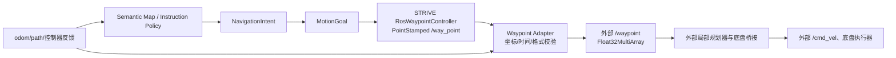

# 实物控制链原理、数学模型与方案设计

## 1. 设计边界

当前实物控制链采用“高层目标交给外部底盘控制器”的分层方案：



职责边界如下：

- HuaweiVLN/STRIVE 负责语义目标、目标点生成、waypoint 格式适配和状态监视。
- waypoint adapter 不做局部避障、速度控制或急停，不发布 `/cmd_vel`。
- 外部控制器负责 `/waypoint` 的执行、速度限制、底盘 mux、急停和人工接管。
- 当前 `approval_status=unapproved`，真实 waypoint 交接和真实运动均保持关闭。

## 2. 变量和坐标系

定义：

- (W)：高层世界坐标系，通常为 `map` 或当前系统约定的全局 frame；
- (B)：机器人机体坐标系，通常为 `base_link`/`base`；
- (p_W^*=[x_W^*,y_W^*,z_W^*]^T)：高层生成的目标点；
- (T_{WB}=[R_{WB},t_{WB}])：odometry 给出的机体在世界系中的位姿；
- (R_{WB}in SO(3))：从机体坐标到世界坐标的旋转；
- (t_{WB}inmathbb{R}^3)：机体原点在世界系中的位置。

齐次坐标关系为：

\[
\begin{bmatrix}p_W\\1\end{bmatrix}
=
\begin{bmatrix}R_{WB}&t_{WB}\\0&1\end{bmatrix}
\begin{bmatrix}p_B\\1\end{bmatrix}.
\]

因此，世界系目标转换到机体系为：

\[
p_B^*=R_{WB}^{T}(p_W^*-t_{WB}).
\]

当前 Python 实现 `real_robot.waypoint_adapter._world_to_ego()` 使用平面 yaw 版本。若
机器人 yaw 为 \(\psi\)，则：

\[
\begin{aligned}
\Delta x &= x_W^*-x_B,\\
\Delta y &= y_W^*-y_B,\\
x_B^* &= \cos\psi\,\Delta x+\sin\psi\,\Delta y,\\
y_B^* &=-\sin\psi\,\Delta x+\cos\psi\,\Delta y.
\end{aligned}
\]

这里的 (x_B^*,y_B^*) 是外部控制器需要的 ego-frame 目标；是否确实采用该语义，
仍必须由底盘控制器所有者确认。

如果机器人使用固定二维安装补偿，则 adapter 的 `static_se2` 模式为：

\[
p_{out}=R(\theta_s)p_{in}+t_s,
\quad
R(\theta_s)=
\begin{bmatrix}
\cos\theta_s&-\sin\theta_s\\
\sin\theta_s&\cos\theta_s
\end{bmatrix}.
\]

`identity` 模式不做坐标变换，仅适用于输入和输出已经处于同一坐标语义的情况。

## 3. Waypoint 格式转换

STRIVE 输入：

```text
/way_point : geometry_msgs/msg/PointStamped
```

消息包含：

\[
m=(t_m, f_m, x_W^*,y_W^*,z_W^*)
\]

adapter 首先检查 frame：

\[
f_m=f_{expected}.
\]

不相等时丢弃消息，不进行隐式 frame 猜测。

时间新鲜度定义为：

\[
a=t_{now}-t_m.
\]

当配置 `max_input_age_s=\tau` 时：

\[
0\le a\le\tau
\]

才允许转换；(a>\tau) 的消息被丢弃，(a< -\tau) 的未来消息被视为时间错误。
时间戳为零时按无时间戳处理，但现场控制器不应依赖这种模式。

转换后的外部消息为：

\[
y=
\begin{cases}
[x_B^*,y_B^*]^T,&\texttt{include\_z=false},\\
[x_B^*,y_B^*,z_W^*]^T,&\texttt{include\_z=true}.
\end{cases}
\]

```text
/waypoint : std_msgs/msg/Float32MultiArray
```

当前 adapter 对输出 topic 做安全校验，禁止配置为 `/cmd_vel` 或其子路径。

## 4. 高层目标到 waypoint

高层策略先输出：

\[
\text{SemanticMapSnapshot}
\rightarrow \text{NavigationIntent}
\rightarrow \text{MotionGoal}.
\]

只有满足：

\[
\text{mode}\notin\{WAIT,STOP\},
\quad
\text{goal\_pose}\ne\varnothing
\]

才允许生成 waypoint。`WAIT` 和 `STOP` 不应伪造成运动点。

`RosWaypointController` 为每个目标生成内部 `goal_id`，填充：

```text
header.frame_id = goal.goal_pose.frame_id
header.stamp    = 当前 ROS 时间
point.x/y/z     = goal.goal_pose.position
```

它只发布 `PointStamped`，不计算速度，也不直接接触 `/cmd_vel`。

## 5. 导航状态数学模型

对目标 (p^*) 和当前 odom 位姿 (p(t))，定义误差：

\[
e(t)=p^*-p(t),
\]

\[
d_{xy}(t)=\sqrt{e_x(t)^2+e_y(t)^2},
\quad
d_z(t)=|e_z(t)|,
\quad
d_3(t)=\sqrt{e_x^2+e_y^2+e_z^2}.
\]

当前 `RosNavigationStatusProvider` 的几何到达条件是：

\[
d_{xy}(t)\le \epsilon_{xy}
\quad\land\quad
d_z(t)\le\epsilon_z.
\]

当前默认值为：

```text
xy_goal_tolerance_m = 0.35
z_goal_tolerance_m  = 1.0
```

由于 `PointStamped` 不携带目标朝向，当前不检查 heading。若未来接口加入 yaw，才可增加：

\[
|\operatorname{wrap}(\psi^* - \psi(t))|\le\epsilon_\psi.
\]

进度定义为：

\[
P(t)=\operatorname{clip}\left(
\frac{d_3(t_0)-d_3(t)}{d_3(t_0)},0,1
\right).
\]

若连续 `no_progress_timeout_s` 时间内没有至少
`min_progress_delta_m` 的距离改善，则推断为 `BLOCKED`；超过
`navigation_timeout_s` 则推断为 `TIMEOUT`。这些是 STRIVE 侧的监视推断，不能替代
外部控制器的硬件 watchdog。

状态集合为：

```text
IDLE -> QUEUED -> RUNNING -> REACHED
                     |          |
                     +-> BLOCKED|
                     +-> TIMEOUT|
                     +-> PREEMPTED/FAILED
```

外部 planner 的显式状态只有在 topic 已配置且消息未过期时才优先使用；当前机器人上
`/topoplan/reached_goal` 尚未形成可用的真实反馈契约。

## 6. 外部底盘的控制模型（接口外的理论模型）

HuaweiVLN 不实现或拥有外部 PD/mux 控制器。若外部控制器采用平面 waypoint 跟踪，常见
误差模型为：

\[
e_B=\begin{bmatrix}x_B^*\\y_B^*\end{bmatrix},
\quad
u_{raw}=K_p e_B+K_d\dot e_B,
\quad
u=\operatorname{sat}(u_{raw};u_{max}).
\]

对全向底盘，可用：

\[
\dot x_W=v_x\cos\psi-v_y\sin\psi,
\]
\[
\dot y_W=v_x\sin\psi+v_y\cos\psi,
\quad
\dot\psi=\omega.
\]

其中 (u=[v_x,v_y,\omega]^T) 的限幅、加速度约束、避障和 `/cmd_vel` 发布必须由外部
底盘所有者实现和验收；这些方程不是当前 STRIVE 已运行的控制器代码。

## 7. 安全状态机

真实交接建议使用以下状态：

```text
BLOCKED
  -> SHADOW_TEST
  -> BENCH_ARMED
  -> SUPERVISED_LOW_SPEED
  -> APPROVED_HANDOFF
  -> FAULT / ESTOP
```

当前状态为 `BLOCKED`。从 `BLOCKED` 离开必须同时满足：

1. controller contract 的 `approval_status=approved`；
2. `allow_strive_waypoint_handoff=true`；
3. 外部控制器所有者确认 `/waypoint` 消息类型、单位、frame 和数组语义；
4. 到达、阻塞、超时、取消/抢占和心跳反馈均有实测定义；
5. 速度、加速度、目标 watchdog、急停和人工接管均完成验收；
6. `cmd_vel_direct_publish=false` 始终保持不变。

任何以下条件出现，都应回到 `BLOCKED`：

```text
waypoint 过期或 frame 错误
odom 丢失或时间异常
反馈超时/语义未知
急停状态不确定
外部控制器所有权不明确
```

## 8. 当前代码对应关系

| 模块 | 当前实现 | 真实状态 |
|---|---|---|
| `SemanticMapSnapshot` / planner | 语义目标和目标点生成 | 已实现、可 dry-run |
| `RosWaypointController` | `MotionGoal → PointStamped` | 已实现，真实发布默认关闭 |
| `WaypointFormatAdapter` | frame、时间、SE(2)/odom 转换 | 已实现，影子 topic 已验证 |
| `RosNavigationStatusProvider` | odom/path/进度/超时推断 | 已实现，尚未接真实底盘反馈 |
| 外部 `/waypoint` | `Float32MultiArray` 控制入口 | 未实际交接 |
| 外部底盘/mux | 速度和运动执行 | 不属于本项目 |
| `/cmd_vel` | 底盘速度输出 | STRIVE 禁止直接发布 |
| 急停/人工接管 | 平台安全链路 | 未确认，不能启用 |

因此，当前实现是“高层到 waypoint 的软件链路 + 安全监视骨架”，不是已批准的真实运动
闭环。完成真实闭环的最小新增工作是：补齐 controller contract，接入真实反馈消息
到 `RosNavigationStatusProvider`，由外部所有者完成台架和低速验收，然后才允许打开
`output_enabled` 和 lower-controller handoff。
