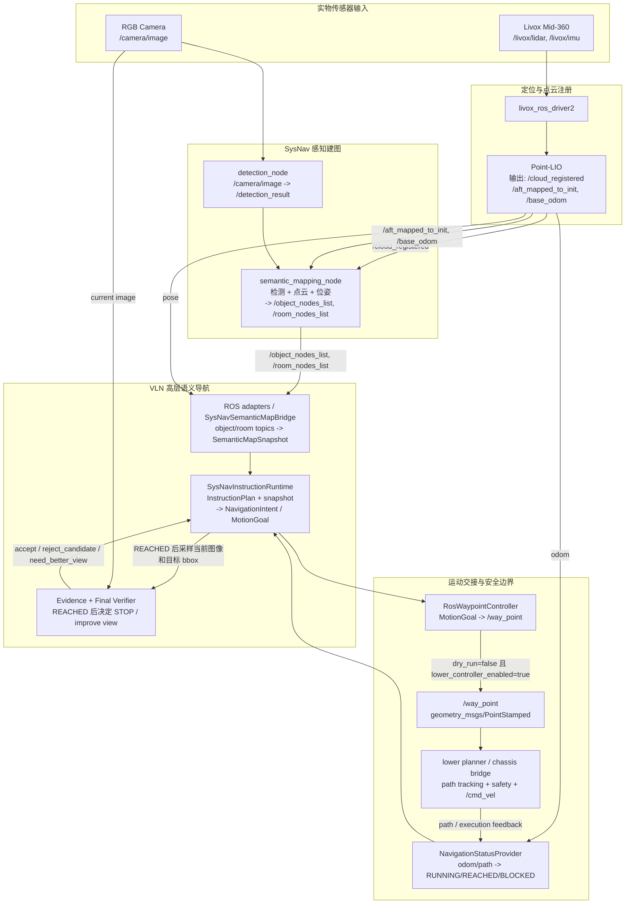

# VLN 实物部署接口设计

> 框架 contract、数据流、异步控制流和不同机器人执行器的扩展模板见
> [real_robot_framework.md](real_robot_framework.md)。本文保留 SysNav/Orin 的具体
> 部署步骤和验收命令。

> **Orin-26 实施状态**：实时执行清单、已验证的硬件观测和未解除的安全门槛维护在
> [`real_robot_deployment_checklist.md`](real_robot_deployment_checklist.md)。首次部署请从
> `real_robot/profiles/orin26_livox_mid360_generic_rgb.env` 与
> `scripts/run_real_robot_profile.sh` 开始；它们默认只读传感器、禁用语义融合和真实运动。

本文档整理 VLN 从 HM3D/Habitat 仿真迁移到真实机器人时的接口设计、模块边界、输入输出数据流和上下层规划闭环。目标不是把仿真代码直接搬到机器人上，而是建立一个可插拔的 real-robot runtime，让 VLN 的高层语义导航能力复用真实机器人传感器、SLAM 和底层运动控制。

## 1. 设计目标

实物模式需要满足四个边界：

1. 保持 benchmark 模式不变。
2. 将真实传感器数据适配成 VLN 内部统一观测格式。
3. VLN 只负责语义目标理解、目标确认、关系验证和高层子目标选择。
4. 底层局部避障、路径跟踪、速度控制和安全停止交给 ROS/机器人规划控制栈。

推荐总体形态：

```text
Real sensors / ROS topics
  -> real_robot adapters
  -> VLN semantic mapper and instruction planner
  -> NavigationIntent
  -> ROS navigation bridge
  -> local planner / path follower / robot base
```

### 1.1 固定主链

实物主链应固定为下面这条路径。后续新增相机、底盘、检测器或先验地图时，
只能替换链路中的 adapter、provider 或 policy，不能绕过 `NavigationIntent`
直接发布底层控制命令。

```text
Robot sensor topics
  -> SysNav detection_node / semantic_mapping_node
  -> /detection_result, /object_nodes_list, /room_nodes_list
  -> RosDetectionResultAdapter / RosObjectNodeAdapter / RosRoomNodeAdapter
  -> SemanticMapSnapshot
  -> SemanticMapSnapshotPolicyContext
  -> planning.select_target_candidate(...)
  -> existing upper instruction policy / intent adapter
  -> NavigationIntent
  -> MotionGoal
  -> RosWaypointController
  -> /way_point
  -> lower planner / path follower / robot controller
  -> NavigationStatus
  -> ViewEvidence
  -> FinalInstructionVerifier
```

这条链路有四个强边界：

| 边界 | 输入 | 输出 | 不能做什么 |
| --- | --- | --- | --- |
| ROS adapter | ROS message | `DetectionFrame`、`ObjectNodeSnapshot`、`RoomSnapshot` | 不能做目标语义判断，不能改写 SysNav 地图状态 |
| Semantic policy | `SemanticMapSnapshot`、`InstructionPlan`、可选先验地图 context | `NavigationIntent` | 不能发布 ROS topic，不能直接声明物理到达 |
| Motion bridge | `MotionGoal` | `/way_point`、`NavigationStatus` | 不能调用 VLM，不能判断自然语言任务是否成功 |
| Evidence loop | `ViewpointGoal`、`NavigationStatus`、当前观测 | `ViewEvidence`、verifier decision | 未到达视点时不能伪造 final verifier 证据 |

核心模块输入输出可以用下面的 Mermaid 图概括：



图中要点：

```text
VLN 不直接发布 /cmd_vel。
VLN 对底层控制器的正常输出只有 MotionGoal 经 RosWaypointController 转成 /way_point。
dry_run=true 或 lower_controller_enabled=false 时，不向真实 /way_point 交接。
FinalInstructionVerifier 只能在 NavigationStatus.REACHED 后消费 ViewEvidence。
Point-LIO 是实物链路中的定位和 registered cloud 来源，不承担语义目标判断。
RosObservationCache、ObjectCropEvidenceProvider、InstructionPlan provider 等作为 VLN
内部实现细节保留，不在核心数据流图中展开。
```

当前仓库已经具备 contract、SysNav ROS adapter、motion goal、live ROS node、
`NavigationStatus` provider、观测缓存、crop evidence provider，以及消费
`SemanticMapSnapshot` 的高层策略适配上下文。后续重点是安全边界、真实
`InstructionPlan` provider、final verifier 接线和端到端 smoke。详细待做项见
`docs/real_robot_todo_checklist.md`。

## 2. 硬件与传感器

原论文中的真实平台配置：

```text
Base:
  Mecanum wheel platform

RGB / RGB-D sensor:
  Primary: Ricoh Theta Z1 360-degree panoramic camera
  Optional: Intel RealSense RGB-D camera

Spatial sensor:
  Livox Mid-360 LiDAR

Compatibility:
  LiDAR point clouds can be converted to depth maps when VLN needs
  simulation-like RGB-D inputs.
```

默认配置和 SysNav 的 wheeled robot 分支高度一致。RealSense 也可以接入，
但应作为另一个 `CameraAdapter` 实现，而不是替换接口中的相机抽象。
SysNav 使用 ROS2，将真实机器人分解为多个节点：

```text
livox_ros_driver2
  -> Mid-360 point cloud

arise_slam_mid360
  -> state estimation / odometry

semantic_mapping
  -> object detection, SAM2 segmentation, object graph

vlm_node
  -> instruction decomposition, room selection, object/anchor verification

tare_planner / local_planner / pathFollower
  -> exploration, local path, cmd_vel, serial control
```

## 3. 当前 VLN 仿真接口

当前 HM3D runtime 的主入口仍是 Habitat 风格：

```text
objnav_benchmark_with_process_obs.py
  -> Habitat env
  -> HM3D_Objnav_Agent
  -> Instruct_Mapper
```

单步输入：

```text
obs["rgb"]   : H x W x 3 uint8
obs["depth"] : H x W x 1 float32
pose         : Habitat sensor state
```

单步输出：

```text
Habitat discrete action:
  move_forward / turn_left / turn_right / stop
```

这套接口在真实机器人上不能直接使用。真实机器人没有 Habitat dense depth，也不应该由高层直接输出离散 action 或 `/cmd_vel`。

## 4. 推荐真实机器人分层

### 4.1 Sensor Adapter

职责：订阅真实传感器和 SLAM 输出，生成 VLN 可消费的统一观测。

输入建议：

```text
/camera/image
  sensor_msgs/Image
  Ricoh Theta Z1 panoramic RGB, or RealSense RGB

/registered_scan
  sensor_msgs/PointCloud2
  Livox Mid-360 registered point cloud

/camera/aligned_depth_to_color/image_raw
  sensor_msgs/Image
  Optional RealSense aligned depth

/state_estimation
  nav_msgs/Odometry
  SLAM pose in map frame
```

输出 contract：

```python
RealObservation:
    rgb: np.ndarray
    pointcloud: np.ndarray
    pose: SE3
    timestamp: float
    camera_model: str
    intrinsics: dict
    extrinsics: SE3
    fov: dict
    rgb_pano: np.ndarray | None
    depth_pano: np.ndarray | None
    depth: np.ndarray | None
    depth_valid_mask: np.ndarray | None
    frame_ids: dict[str, str]
```

关键原则：

```text
RGB 是语义主输入。
LiDAR point cloud 是几何主输入。
RealSense aligned depth 是局部 pinhole RGB-D 的直接几何输入。
projected depth 只是兼容层，不能假设和 Habitat dense depth 等价。
```

相机模型建议显式标注：

```python
CameraFrame:
    rgb: np.ndarray
    depth: np.ndarray | None
    camera_model: Literal["panorama", "pinhole"]
    intrinsics: dict
    extrinsics: SE3
    fov: dict
    timestamp: float
```

Theta Z1 对应 `camera_model="panorama"`；RealSense 对应
`camera_model="pinhole"`。上层 planner 不应直接判断相机品牌，而应只看
camera model、FOV、depth availability 和当前 evidence quality。

### 4.2 Depth / Cloud Fusion Adapter

职责：将 LiDAR 点云与相机图像对齐，并统一处理全景和 pinhole 相机。

输入：

```text
rgb or rgb_pano
registered point cloud
camera intrinsics / panorama projection model / pinhole projection model
camera-to-lidar extrinsic
lidar-to-map pose
optional RealSense aligned depth
```

输出：

```text
projected_depth
depth_valid_mask
colored point cloud
camera-frame object points
```

核心算法：

```text
1. 按 timestamp 对齐 RGB、LiDAR、odom。
2. 将 LiDAR 点从 map/sensor frame 变换到 camera frame。
3. 根据 camera_model 选择投影模型：
   - panorama: 使用 Theta 全景投影得到 pixel coordinate。
   - pinhole: 使用 RealSense intrinsics 投影到局部 RGB frame。
4. 对每个 pixel 保留最近 depth。
5. 输出 sparse depth 和 valid mask。
```

注意事项：

```text
不要用 sparse depth 直接替代 Habitat depth 做所有三维重建。
小物体附近的 depth 缺失必须保留为 unknown，而不是插值成虚假表面。
RealSense FOV 较窄，不具备 Theta 一次观测 360 度上下文的能力。
```

RealSense 接入策略：

```text
RealSense RGB + aligned depth
  -> RealSenseCameraAdapter
  -> pinhole CameraFrame
  -> depth 直接反投影为局部点云
  -> 若需要全景上下文：
       机器人原地旋转采集多帧
       或只在局部视角内执行 detection / verification
```

经验判断：

```text
Theta 更适合房间级语义判断、快速全局观察和远距离上下文。
RealSense 更适合近距离目标确认、小物体检测和稳定 RGB-D 几何。
```

### 4.3 Detector Adapter

职责：统一不同检测器的输出格式。

当前 VLN benchmark 使用：

```text
MMDINOSAM_Perceiver / GroundingDINO + SAM
```

SysNav 真实机器人使用：

```text
YOLO World / YOLOE tracking
SAM2 segmentation
```

推荐统一输出：

```python
DetectionFrame:
    image: np.ndarray
    boxes_xyxy: np.ndarray
    labels: list[str]
    confidences: list[float]
    masks: list[np.ndarray] | None
    track_ids: list[int] | None
    timestamp: float
```

可插拔实现：

```text
SimulationDetectorAdapter
  -> calls current VLN perceiver

ROSDetectionResultAdapter
  -> subscribes /detection_result

DirectRealDetectorAdapter
  -> runs detector inside VLN real runtime
```

建议优先复用 SysNav 的 `/detection_result`，降低实物模式初期风险。

### 4.4 Semantic Map Adapter

职责：把真实检测、分割、点云、pose 融合成对象图和导航图。

VLN 当前内部状态：

```text
mapper.objects
mapper.nodes
mapper.room_nodes
mapper.grid_map
mapper.frontiers
mapper.navigable_pcd
mapper.obstacle_pcd
```

推荐导出统一快照：

```python
SemanticMapSnapshot:
    timestamp: float
    robot_pose: SE3
    objects: list[ObjectNode]
    nav_nodes: list[NavNode]
    rooms: list[RoomNode]
    frontiers: list[Frontier]
```

对象节点：

```python
ObjectNode:
    uid: str | int
    label: str
    confidence: float
    position: np.ndarray
    bbox2d: list[float] | None
    bbox3d_center: np.ndarray | None
    bbox3d_extent: np.ndarray | None
    image_ref: str | None
    pointcloud_ref: str | None
    room_id: int | None
    visible_viewpoints: list[int]
    verified_state: str
```

这层应保持独立于 ROS message。ROS bridge 可以负责消息转换，VLN 内部只消费 Python contract。

## 5. 高层导航器接口

真实机器人模式下，VLN 高层不输出 discrete action，而输出语义导航意图。

推荐 contract：

```python
NavigationIntent:
    mode: str
    goal_pose: Pose2D | None
    target_object_uid: str | None
    anchor_object_uid: str | None
    relation_edge_id: str | None
    stop_allowed: bool
    reason: str
```

典型 mode：

```text
explore_room
go_to_frontier
go_to_object
go_to_anchor
improve_view
stop
wait
```

高层模块职责：

```text
Instruction parser:
  原始自然语言 -> InstructionPlan

Concept grounding:
  target / anchor / support region 概念归一

Runtime concept matcher:
  observed object -> target/anchor concept

Constraint evaluator:
  room / attribute / count / sequence / relation

Dynamic relation verifier:
  object-object relation edge, e.g. on / near / inside

Final instruction verifier:
  原始 prompt 是否已满足

View controller:
  语义满足但视角不足时，围绕 pinned target/relation 改善视角
```

这部分可以直接复用当前 instruction adapter 的核心设计。

## 6. 下层规划与控制接口

SysNav 下层已经给出了很好的真实机器人闭环：

```text
high-level planner
  -> /way_point

localPlanner
  subscribes:
    /state_estimation
    /registered_scan
    /terrain_map
    /way_point
    /navigation_boundary
    /added_obstacles
    /check_obstacle
  publishes:
    /path
    /slow_down
    /free_paths

pathFollower
  subscribes:
    /state_estimation
    /path
    /joy
    /speed
    /stop
  publishes:
    /cmd_vel
  optional:
    serial /dev/ttyACM0
```

VLN 实物模式建议只发布 waypoint：

```text
NavigationIntent.goal_pose
  -> geometry_msgs/PointStamped
  -> /way_point
```

不要让 VLN 高层直接发 `/cmd_vel`。原因：

```text
cmd_vel 需要实时安全控制。
局部避障、急停、速度限制和手柄接管都应该在下层闭环中完成。
语义层调用 VLM/LLM，延迟不可控，不适合直接控制底盘。
```

### 6.1 VLN 仿真 action API 与实物 motion API 的差异

当前 VLN/Habitat runtime 使用同步离散控制接口。高层 planner 先生成
连续空间中的 waypoint 或 better-view viewpoint，然后通过 Habitat
shortest-path follower 转成离散动作：

```text
VLN selected waypoint/viewpoint
  -> habitat_waypoint()
  -> Habitat shortest-path follower
  -> discrete action: STOP / MOVE_FORWARD / TURN_LEFT / TURN_RIGHT
  -> env.step(action)
  -> synchronous RGB-D observation
```

这套接口成立依赖 Habitat 提供的几个仿真假设：

```text
global navmesh is available
shortest-path query is reliable
agent motion is discretized and deterministic enough
env.step(action) immediately returns synchronized RGB / depth / pose
collision and kinematic details are absorbed by the simulator
```

真实机器人不具备这个同步 `env.step` 抽象。SysNav 的底层是连续控制链路：

```text
semantic / exploration planner
  -> geometry_msgs/PointStamped on /way_point
  -> localPlanner selects a collision-aware local path
  -> nav_msgs/Path on /path
  -> pathFollower tracks path and publishes /cmd_vel/autonomy
  -> SafetyVelocityMux arbitrates and publishes the final /cmd_vel
  -> robot moves asynchronously
  -> sensors publish RGB / LiDAR / odom with latency
```

因此实物模式不能复刻 Habitat discrete action。VLN 应保留
“生成可解释语义子目标和视角目标”的能力，但必须把“执行目标”的责任交给
一个异步 motion layer。

### 6.2 MotionController contract

建议在 real-robot runtime 中新增 `MotionController` 抽象，统一仿真和实物
两种执行模型：

```python
class MotionController:
    def send_goal(self, goal: MotionGoal) -> str:
        """Submit a navigation or viewpoint goal and return a goal id."""

    def poll_status(self, goal_id: str) -> NavigationStatus:
        """Return reached / running / blocked / timeout / preempted."""

    def cancel(self, goal_id: str) -> None:
        """Cancel the active lower-level motion goal."""

    def hold(self) -> None:
        """Ask the lower layer to stop safely without taking over velocity control."""
```

仿真实现可以包装当前 Habitat action loop：

```text
HabitatDiscreteController
  MotionGoal -> self.waypoint
  poll_status -> repeated planner.get_next_action() and env.step(action)
```

实物实现应包装 SysNav ROS 接口：

```text
RosWaypointController
  MotionGoal -> /way_point
  poll_status -> /state_estimation + /path + timeout + progress monitor
  hold -> /stop or controller-specific safe hold
  cancel -> lower-planner cancel topic + safe hold
```

上层 planner 只看到 `MotionGoal` 和 `NavigationStatus`，不关心底层是离散
action、ROS waypoint，还是某个实物平台的自定义导航接口。

当前 `RosWaypointController` 的安全边界已经固定：

```text
waypoint_topic
  只能是 waypoint/test waypoint，不允许 /cmd_vel 或 */cmd_vel。

hold_topic
  可选 std_msgs/Empty 信号，由平台安全节点解释。

cancel_topic
  可选 std_msgs/Empty 信号；迁移后的 SysNav localPlanner 接收后清理旧目标
  并发布单点零路径。cancel() 同时发送 hold，确保安全 mux 立即停止输出。

emergency_stop_topic
  可选 std_msgs/Empty 信号；默认不发布。
  只有 allow_emergency_stop_publish=true 时，hold() 才会同时发布该 topic。
```

这意味着 VLN 高层不会绕过平台 local planner / safety controller 直接接管速度控制。

### 6.3 ViewpointGoal 与异步证据采集

VLN 的 better-view 逻辑会生成多个候选 viewpoint。仿真中这些 viewpoint
可以直接通过 Habitat pathfinder 可达性检查和离散动作执行；实物中 viewpoint
必须被建模为一个异步目标：

```python
ViewpointGoal:
    pose: Pose2D | Pose3D
    look_at: Point3D | None
    target_uid: str | None
    anchor_uid: str | None
    relation_edge_id: str | None
    purpose: explore | verify_target | verify_relation | improve_view
    tolerance: dict
```

执行结果也必须显式返回：

```python
ViewpointResult:
    status: reached | blocked | timeout | preempted
    final_pose: Pose
    evidence: ViewEvidence | None
    path_length: float | None
    reason: str
```

真实机器人最终确认流程应是：

```text
send ViewpointGoal
  -> wait for NavigationStatus
  -> if reached or best available: acquire RGB / LiDAR / pose snapshot
  -> project target / anchor evidence
  -> final verifier checks semantic, relation, and view quality
  -> accept / try next viewpoint / abandon this instance
```

这里的关键边界是：VLM 负责判断语义、关系和视觉证据质量；motion layer 负责
判断是否到达、是否可达、是否被障碍阻断、是否超时。VLM 不应直接声明物理
可达性，motion layer 也不应直接判断自然语言任务是否满足。

### 6.4 与 SysNav 的对接方式

SysNav 已经把真实机器人底层拆成可复用链路：

```text
/way_point -> localPlanner -> /path -> pathFollower -> /cmd_vel/autonomy
                                                     -> SafetyVelocityMux -> /cmd_vel
```

VLN 实物模式应先对接这个最小公共接口，而不是复制 SysNav 的整套 planner。
推荐桥接：

```text
NavigationIntent(mode="go_to_object" / "improve_view")
  -> MotionGoal / ViewpointGoal
  -> RosWaypointController publishes /way_point
  -> SysNav localPlanner/pathFollower executes continuous motion
  -> bridge monitors odom/path progress
  -> VLN acquires evidence and updates verifier state
```

如果后续接入不同实物平台，只需要替换 `MotionController` 和 sensor adapters：

```text
Mecanum + SysNav localPlanner:
  RosWaypointController

Nav2-based platform:
  Nav2ActionController

Quadruped / humanoid:
  PlatformMotionController

Offline bag replay:
  ReplayMotionController
```

这样 VLN 的 instruction parser、concept grounding、relation verifier、
final verifier 和 view-control state 都可以保持平台无关。

## 7. 上下层闭环

推荐真实机器人闭环：

```text
1. SensorAdapter 读取 RGB / LiDAR / odom。
2. DetectorAdapter 生成 detection frame。
3. SemanticMapBuilder 更新对象图、房间、frontier 和导航节点。
4. Instruction planner 读取 SemanticMapSnapshot。
5. Planner 输出 NavigationIntent。
6. ROSNavigationBridge 发布 /way_point。
7. localPlanner 基于点云和地形生成 /path。
8. pathFollower 生成 `/cmd_vel/autonomy`，再由 SafetyVelocityMux 生成最终 `/cmd_vel`。
9. 机器人移动产生新 RGB / LiDAR / odom。
10. 高层根据新证据更新 verifier / ledger / relation edge。
```

停止条件应由三部分共同决定：

```text
instruction_satisfied == true
view_sufficient_for_stop == true
robot_stable_or_goal_reached == true
```

其中：

```text
instruction_satisfied:
  FinalInstructionVerifier 对原始自然语言确认。

view_sufficient_for_stop:
  目标/anchor/relation 在当前视角中有足够证据。

robot_stable_or_goal_reached:
  底层报告 waypoint 到达，或已无法继续改善视角且证据充分。
```

## 8. 与 SysNav 的对照

| 层级 | SysNav | VLN 当前 | VLN 实物建议 |
| --- | --- | --- | --- |
| 传感器 | ROS2 topics | Habitat observation | RealObservationAdapter |
| RGB / RGB-D | `/camera/image`, optional RealSense aligned depth | `obs["rgb"]`, `obs["depth"]` | CameraFrame |
| 几何 | `/registered_scan` | `obs["depth"]` | pointcloud + optional projected/aligned depth |
| 位姿 | `/state_estimation` | Habitat sensor state | SE3 pose |
| 检测 | YOLOE / YOLO World | MMDINO/SAM | DetectorAdapter |
| 分割 | SAM2 | SAM | 可插拔 |
| 语义地图 | `/object_nodes_list` | mapper.objects | SemanticMapSnapshot |
| 任务理解 | VLM node | instruction_adapter | 复用 instruction_adapter |
| 房间选择 | VLM room navigation | room_policy / LLM | 可接 room snapshot |
| 高层输出 | `/way_point` | discrete action | NavigationIntent |
| 局部规划 | localPlanner | Habitat SPF | ROSNavigationBridge |
| 底盘控制 | pathFollower / serial | env.step | pathFollower / cmd_vel |

## 9. 实物模块结构

当前仓库已经完成第一版 SysNav-backed 实物骨架。下面的树只列出已存在模块；
相机同步、LiDAR 投影、真机 status provider 等平台相关文件仍属于后续适配点。

```text
real_robot/
  __init__.py
  contracts.py
  detector_vocabulary.py
  sysnav_ros_adapters.py
  sysnav_runtime.py
  ros2_ws/
    src/
      tare_planner/
      semantic_mapping/
      strive_sysnav_bringup/

docs/
  real_robot_deployment.md
```

已实现模块职责：

```text
contracts.py
  已定义平台无关 contract：
  RealObservation, DetectionFrame, ObjectNodeSnapshot, RoomSnapshot,
  SemanticMapSnapshot, NavigationIntent, MotionGoal, ViewpointGoal,
  NavigationStatus, ViewEvidence, RuntimeDecision。
  该层只依赖 Python 标准库，不引入 ROS、Habitat、numpy 或 detector 实现。

detector_vocabulary.py
  读取 SysNav objects.yaml，生成 DetectorVocabulary；
  记录 detector_name、label_space、prompt_space、is_instance 和 label provenance；
  只做 detector config 内的 canonical/prompt 字面匹配，不做自然语言 alias 推断。

sysnav_ros_adapters.py
  第一版 SysNav 复用层：
  RosDetectionResultAdapter 将 /detection_result 转为 DetectionFrame；
  RosObjectNodeAdapter 将 /object_nodes_list 转为 ObjectNodeSnapshot；
  RosRoomNodeAdapter 将 /room_nodes_list 转为 RoomSnapshot；
  RosWaypointController 将 MotionGoal 发布为 /way_point。

sysnav_runtime.py
  SysNavSemanticMapBridge 缓存 /object_nodes_list 和 /room_nodes_list；
  SysNavInstructionRuntime 将 SemanticMapSnapshot 交给高层策略并发布 waypoint；
  ViewpointEvidenceLoop 执行 ViewpointGoal 的异步证据采集和 final verifier；
  LatestObservationEvidenceProvider 从最新 RealObservation 和 crop provider 构造 ViewEvidence。

camera_adapter.py
  封装 Theta panorama 与 RealSense pinhole RGB-D 相机差异。

observation_adapter.py
  ROS topic buffer, timestamp sync, pose extraction。

depth_projection.py
  LiDAR point cloud -> panorama/pinhole sparse depth。

detector_adapter.py
  VLN detector / ROS detection result 的统一封装。

semantic_map_adapter.py
  将 real observation + detection 转成 mapper update 输入或 map snapshot。

navigation_bridge.py
  NavigationIntent -> MotionGoal / ViewpointGoal，读取 path/odom/stop 状态。

motion_controller.py
  定义 MotionController，并实现 RosWaypointController、ReplayMotionController
  等底层执行适配。高层不直接依赖 Habitat discrete action 或 ROS topic。

runtime_node.py
  实物模式主循环。

ros2_ws/src/tare_planner
  message-only SysNav 兼容包，提供 DetectionResult、ObjectNode、RoomNode 等消息。
  第一版不编译完整 TARE C++ planner，避免检测/建图迁移被局部规划依赖阻塞。

ros2_ws/src/semantic_mapping
  已迁入 SysNav detection_node 和 semantic_mapping_node。
  detection_node 订阅 /camera/image，发布 /detection_result；
  semantic_mapping_node 订阅 /detection_result、/registered_scan、/state_estimation，
  发布 /object_nodes_list。

ros2_ws/src/strive_sysnav_bringup
  启动 detection_node 和 semantic_mapping_node 的 launch-only 包。
```

后续预留模块建议保持接口级实现，而不是直接耦合到某个实物平台：

```text
camera_adapter.py
  封装 Theta panorama、RealSense pinhole RGB-D 或其他相机驱动；
  输出 CameraFrame，不直接调用 detector 或 planner。

observation_adapter.py
  管理 ROS topic buffer、timestamp sync、pose extraction；
  输出 RealObservation，保证 RGB/LiDAR/odom 绑定同一 robot_pose。

depth_projection.py
  LiDAR point cloud -> panorama/pinhole sparse depth；
  只做几何投影，不把 sparse depth 当作 dense Habitat depth。

status_provider.py
  从 odom、path progress、局部规划器状态和急停状态生成 NavigationStatus；
  这是实车闭环必须补齐的模块，RosWaypointController 本身不猜测是否到达。

runtime_node.py
  实物模式主循环：
  SemanticMapSnapshot -> InstructionPolicy -> NavigationIntent -> MotionGoal
  -> RosWaypointController -> NavigationStatus -> ViewpointEvidenceLoop。
```

第一版 SysNav-backed VLN 的实物数据流应读作：

```text
/camera/image
  -> SysNav detection_node
  -> /detection_result
  -> SysNav semantic_mapping_node
  -> /object_nodes_list, /room_nodes_list
  -> SysNavSemanticMapBridge
  -> SemanticMapSnapshot
  -> VLN instruction policy / concept grounding / verifier
  -> NavigationIntent
  -> MotionGoal
  -> RosWaypointController
  -> /way_point
  -> SysNav lower planner / robot controller
```

这条链路中，VLN 不写 SysNav map，也不在 ROS adapter 层做同义词推断。
`/object_nodes_list` 中的对象 ID 是 ledger/cache 的主键来源；目标、anchor、
support role 的判断仍由 `InstructionPlan`、`ConceptQuery`、词表 provenance
和视觉证据共同完成。

## 10. 实施路线

### Phase 0: 离线 bag replay

目标：不接真车，先用 rosbag 或导出的 topic 文件验证接口。

输入：

```text
recorded /camera/image
recorded /registered_scan
recorded /state_estimation
```

输出：

```text
RealObservation 序列
debug projected_depth
debug object snapshots
```

验收：

```text
RGB、点云、pose 时间同步误差可记录。
投影 depth 和 RGB 对齐可视化正常。
mapper 不崩溃。
```

### Phase 1: 真实观测适配

目标：实现 `RealObservationAdapter`。

已完成的基础边界：

```text
real_robot/contracts.py
  定义 sensor, detection, semantic map, motion intent, viewpoint,
  navigation status, evidence, runtime decision 的统一数据契约。

tests/test_real_robot_contracts.py
  约束 contract 层保持平台无关，并验证 detection / viewpoint /
  verifier evidence 的基础语义。
```

验收：

```text
可持续输出 rgb_pano / pointcloud / pose。
所有 frame id 和 extrinsic 明确记录。
遇到缺帧时返回 wait，而不是阻塞 planner。
```

### Phase 2: 检测与对象图接入

目标：先复用 SysNav `/detection_result` 或 VLN detector 生成 `DetectionFrame`。

第一版直接复用 SysNav detector + semantic mapping：

```text
/camera/image
  -> SysNav detection_node
  -> /detection_result
  -> SysNav semantic_mapping_node
  -> /object_nodes_list
  -> RosObjectNodeAdapter
  -> SemanticMapSnapshot
  -> VLN instruction_adapter / concept matcher / final verifier
```

这条链路不把 VLN detector 迁移到 SysNav，也不让 VLN 重写 SysNav
semantic_mapping。VLN 只接收 SysNav 已经稳定维护的 object node / room node，
再做 prompt-first 指令解析、concept grounding、relation verifier 和 final verifier。

检测器词表处理：

```text
SysNav objects.yaml
  -> DetectorVocabularyAdapter
  -> DetectorVocabulary(label_space, prompt_space, is_instance)
  -> RosDetectionResultAdapter / RosObjectNodeAdapter metadata
  -> VLN concept grounding context
```

重要边界：

```text
adapter 不把 raw detector label 静默改成任务概念。
adapter 只记录 label_provenance：
  raw_detector_label
  detector_name
  config_path
  known_in_detector_vocabulary
  canonical_label
  prompt_labels
  matched_by
  is_instance

例如 detector 输出 "trash can"：
  ObjectNodeSnapshot.label 仍是 "trash can"；
  metadata.label_provenance.canonical_label 可以记录为 "garbage_bin"；
  是否满足用户说的 "bin" / "garbage can" 仍由 concept matcher / verifier 判断。
```

已实现模块：

```text
RosDetectionResultAdapter
  /detection_result -> DetectionFrame，并写入 detector_vocabulary 与 per-bbox label_provenance

RosObjectNodeAdapter
  /object_nodes_list -> ObjectNodeSnapshot，并写入 label_provenance

RosRoomNodeAdapter
  /room_nodes_list -> RoomSnapshot

SysNavSemanticMapBridge
  缓存 object/room list topic，并构建只读 SemanticMapSnapshot。
```

验收：

```text
ObjectNode uid 稳定。
同一对象不会频繁漂移。
目标/anchor matcher 可以消费真实对象。
```

### Phase 3: 高层输出 waypoint

目标：让 VLN 输出 `NavigationIntent`，通过 bridge 发布 `/way_point`。

已实现模块：

```text
SysNavInstructionRuntime
  SemanticMapSnapshot -> high_level_policy.decide()
  -> NavigationIntent
  -> MotionGoal
  -> RosWaypointController.send_goal()
  -> /way_point
```

核心边界：

```text
VLN 只输出语义 intent 和 waypoint。
SysNav localPlanner/pathFollower 继续负责局部避障、路径跟踪和速度控制。
```

验收：

```text
localPlanner 收到 waypoint。
pathFollower 能跟踪 path。
VLN 不直接控制 cmd_vel。
```

### Phase 3.5: MotionController 与异步 viewpoint 执行

目标：把 VLN 当前的同步 action loop 抽象为平台无关的 motion contract。

已实现模块：

```text
ViewpointEvidenceLoop
  ViewpointGoal
    -> goal.as_motion_goal()
    -> motion_controller.send_goal()
    -> poll NavigationStatus until reached / blocked / timeout
    -> evidence_provider.capture()
    -> final_verifier.verify()
    -> ViewpointResult

LatestObservationEvidenceProvider
  latest RealObservation + object crop provider
    -> ViewEvidence
```

伪代码：

```python
goal_id = motion_controller.send_goal(viewpoint_goal.as_motion_goal())
status = motion_controller.poll_status(goal_id)

while not status.is_terminal():
    status = motion_controller.poll_status(goal_id)

if status.succeeded():
    evidence = evidence_provider.capture(viewpoint_goal, status)
    decision = final_verifier.verify(evidence, context)
else:
    decision = {"decision": "motion_failed", "status": status.status}
```

关键原则：

```text
只有 motion layer 报告 reached 后，才采集 final verifier evidence。
blocked / timeout 不能伪造成成功视角。
VLM 判断语义与视觉证据质量；motion layer 判断是否到达和是否可执行。
```

验收：

```text
HabitatDiscreteController 可以包装原仿真 step loop。
RosWaypointController 可以发布 /way_point 并轮询到达状态。
ViewpointGoal 可以携带 look_at / target_uid / relation_edge_id。
ViewpointResult 可以记录 reached / blocked / timeout 和最终 evidence。
final verifier 只在 evidence acquisition 之后调用。
```

该阶段完成后，VLN 的 better-view 逻辑就不再依赖 Habitat discrete action；
实物模式只需要替换底层 controller 和 observation adapter。

### Phase 4: 目标确认闭环

目标：复用 instruction verifier、relation verifier、view-control。

第一版接口已经保留闭环入口：

```text
ViewEvidence.for_verifier()
  提供 image_ref、bbox、pose、target uid、anchor uid、relation edge id、
  view quality、verifier payload。

ViewpointEvidenceLoop.final_verifier
  可接现有 FinalInstructionVerifier 的薄封装，
  也可接 SysNav/CogNav 的独立 verifier node。
```

当前实现没有把现有 Habitat agent 的 `final_instruction_check()` 直接搬到实物
runtime。原因是该函数依赖仿真 agent 状态、日志路径和 mapper 内部对象。实物模式应
通过薄 wrapper 把 `ViewEvidence` 转成现有 verifier 需要的 candidate/evidence
payload，而不是让 real-robot runtime 继承 Habitat agent。

验收：

```text
red chair:
  错误实例会被 ledger 屏蔽。

book on shelf:
  anchor/target/relation edge 可验证。

cup:
  能使用 support region 或 anchor-first 策略去桌面/柜台区域搜索。
```

### Phase 5: 真车小范围测试

测试顺序：

```text
find chair
find table
find cup
red chair
book on shelf
cup on desk
```

每个测试必须保存：

```text
raw observation log
projected depth visualization
semantic map snapshot
NavigationIntent trace
VLM raw response
final verifier result
lower planner status
```

## 11. 关键风险

### 11.1 时间同步

真实系统中 RGB、LiDAR、odom 不会天然同步。必须记录：

```text
rgb_stamp
cloud_stamp
odom_stamp
max_sync_delta
```

超出阈值时应返回 `wait` 或降低该帧置信度。

### 11.2 坐标系

必须显式维护：

```text
map
vehicle/base_link
sensor/lidar
camera
```

禁止在业务逻辑里散落手写坐标转换。所有转换应集中到 adapter 或 geometry module。

### 11.3 Sparse depth

LiDAR projected depth 是稀疏深度，不能假设每个 RGB pixel 都有可靠 depth。

必须在 object reconstruction 中保留：

```text
valid_depth_ratio
point_count
geometry_confidence
```

### 11.4 VLM 调用延迟

实物模式必须使用缓存：

```text
candidate-instance verification cache
relation pair cache
final verifier cache
view-control pinned state
```

同一对象、同一关系、同一证据图不能重复调用 VLM。

### 11.5 安全控制

高层语义模块不承担急停职责。最低要求：

```text
manual joystick override
/stop topic
local obstacle check
planner heartbeat
watchdog timeout
```

## 12. 初始接口草案

### 12.1 已落地的 contract 边界

`real_robot/contracts.py` 目前只表达跨模块数据边界，不负责订阅 topic、
调用 detector、构图或控制底盘。后续任何实物 adapter 都应先把平台相关数据
转成这些 contract，再交给 VLN 高层模块：

```text
RealObservation
  一次同步观测，包含 robot_pose、CameraFrame、pointcloud_ref 和 frame id。

DetectionFrame
  某个 camera frame 上的 detector 输出，包含 bbox、label、confidence、
  track id 和可选 mask 引用。

SemanticMapSnapshot
  高层 planner 的只读地图视图，包含 ObjectNodeSnapshot、RoomSnapshot、
  ViewpointSnapshot 和 FrontierSnapshot。

NavigationIntent
  VLN planner 输出的语义动作意图，例如 go_to_object、go_to_anchor、
  improve_view、verify_relation、stop。

MotionGoal / ViewpointGoal
  navigation bridge 消费的运动目标。ViewpointGoal 额外携带 look_at、
  target uid、anchor uid 和 evidence requirements。

NavigationStatus
  下层运动控制返回的异步状态：running、reached、blocked、timeout、
  preempted、failed。

ViewEvidence
  到达 viewpoint 后采集的图像、bbox、pose 和质量信息，供 final verifier
  或 relation verifier 使用。

RuntimeDecision
  每轮实物 runtime 的可回放决策记录，连接 intent、motion goal、
  lower planner status 和 verifier decision。
```

该边界对应的职责划分是：

```text
VLM / verifier:
  判断 semantic_satisfied、relation_satisfied、view_evidence_quality。

Mapper / planner:
  维护对象、房间、frontier、候选 viewpoint 和目标状态。

Motion controller:
  判断 reached、blocked、timeout、path progress、collision feasibility。

Runtime:
  把上述证据组织成 RuntimeDecision 并落盘。
```

关键实现原则：

```text
contract 层不保存 numpy array 或 ROS message，只保存 image_ref、pointcloud_ref
和 JSON-friendly metadata。
```

这样可以让 live ROS、rosbag replay、离线日志和仿真 adapter 共用同一套
高层 planner / verifier 接口。

### 12.2 SysNav ROS adapter

`real_robot/sysnav_ros_adapters.py` 已实现第一版 SysNav 适配器。该模块的
设计目标是“复用 SysNav 已有 detector、semantic mapping 和 waypoint
controller”，而不是把 ROS 逻辑扩散到 VLN instruction planner。

当前 adapter：

```text
DetectorVocabularyAdapter
  输入：SysNav semantic_mapping/config/objects.yaml
  输出：DetectorVocabulary
  作用：向 concept grounding 暴露 detector label_space / prompt_space / is_instance。

RosDetectionResultAdapter
  输入：tare_planner/DetectionResult
  输出：DetectionFrame
  映射字段：track_id, x1/y1/x2/y2, label, confidence, inline image summary,
  label_provenance。

RosObjectNodeAdapter
  输入：tare_planner/ObjectNode 或 ObjectNodeList
  输出：ObjectNodeSnapshot
  映射字段：object_id, label, position, bbox3d, img_path, viewpoint_id, status,
  label_provenance。

RosRoomNodeAdapter
  输入：tare_planner/RoomNode 或 RoomNodeList
  输出：RoomSnapshot
  映射字段：id, centroid, neighbors, area, is_connected, room_mask reference。

RosWaypointController
  输入：MotionGoal / ViewpointGoal.as_motion_goal()
  输出：geometry_msgs/PointStamped on /way_point
  状态：返回 NavigationStatus，第一版可接入外部 status_provider。
```

SysNav 侧 topic 约定：

```text
/camera/image
  SysNav detection_node 订阅。

/detection_result
  SysNav detection_node 发布，semantic_mapping_node 订阅。

/object_nodes_list
  SysNav semantic_mapping_node 发布，VLN RosObjectNodeAdapter 订阅或离线读取。

/room_nodes_list
  SysNav room_segmentation 发布，VLN RosRoomNodeAdapter 订阅或离线读取。

/way_point
  VLN RosWaypointController 发布，SysNav local planner/path follower 执行。
```

关键边界：

```text
VLN 不直接订阅 /camera/image 做第一版实物检测。
VLN 不直接发布 /cmd_vel。
VLN 不修改 SysNav semantic_mapping_node 内部对象融合逻辑。
VLN 只消费 ObjectNodeSnapshot / RoomSnapshot，并发布 MotionGoal。
VLN adapter 不做 detector label alias；语义映射进入 concept grounding / verifier。
```

如果后续需要把 VLN detector 迁移到 SysNav，应作为替换
`detection_node` 的独立 ROS node，而不是塞进 `RosDetectionResultAdapter`。
adapter 层只做消息转换，不承载模型推理。

### 12.3 Runtime skeleton

```python
class RealRobotNavigator:
    def __init__(
        self,
        observation_adapter,
        detector_adapter,
        mapper,
        high_level_policy,
        navigation_bridge,
    ):
        ...

    def step(self, instruction=None) -> RuntimeDecision:
        observation = self.observation_adapter.read()
        if observation is None:
            wait_intent = NavigationIntent(
                mode=MotionGoalMode.WAIT,
                reason="waiting for synchronized observation",
            )
            return RuntimeDecision(timestamp=time.time(), intent=wait_intent)

        detections = self.detector_adapter.detect(observation)
        snapshot = self.mapper.update_real(observation, detections)
        intent = self.high_level_policy.decide(snapshot, instruction)
        motion_goal = intent.to_motion_goal()
        goal_id = self.navigation_bridge.send_goal(motion_goal)
        status = self.navigation_bridge.poll_status(goal_id)
        return RuntimeDecision(
            timestamp=observation.timestamp,
            intent=intent,
            motion_goal=motion_goal,
            navigation_status=status,
        )
```

`RuntimeDecision` 需要落盘，便于复盘：

```python
RuntimeDecision:
    timestamp: float
    intent: NavigationIntent
    motion_goal: MotionGoal | None
    navigation_status: NavigationStatus | None
    accepted_candidate_uid: str | None
    accepted_relation_edge_id: str | None
    verifier_decision: dict | None
    lower_planner_state: dict | None
```

### 12.4 已实现的最小闭环

当前最小闭环已经能用 fake ROS message / fake controller 在单元测试中跑通：

```text
SysNav object/room list
  -> SysNavSemanticMapBridge.build_snapshot()
  -> high_level_policy.decide(snapshot, instruction)
  -> NavigationIntent.to_motion_goal()
  -> RosWaypointController.send_goal()
  -> NavigationStatus
  -> RuntimeDecision
```

viewpoint 证据闭环：

```text
ViewpointGoal
  -> RosWaypointController / MotionController
  -> wait NavigationStatus.REACHED
  -> LatestObservationEvidenceProvider.capture()
  -> final_verifier.verify(ViewEvidence, context)
  -> ViewpointResult
```

当前已经补上高层 ROS live node，负责把 SysNav topic 缓存为 VLN
snapshot，再周期性调用 `SysNavInstructionRuntime.step()`：

```text
strive_instruction_runtime
  subscribe /object_nodes_list
  subscribe /room_nodes_list
  subscribe /aft_mapped_to_init
  subscribe /camera/image
  -> SysNavSemanticMapBridge
  -> SysNavInstructionRuntime.step(instruction)
  -> RuntimeDecisionJsonlWriter
  -> DryRunMotionController 或 RosWaypointController
```

启动入口：

```bash
bash scripts/run_real_robot_instruction_runtime.sh \
  instruction:="find a book" \
  dry_run:=true \
  policy_mode:=wait \
  run_directory:=/tmp/strive_real_robot_runtime
```

该脚本会 source ROS/overlay，并把仓库根目录加入 `PYTHONPATH`，确保 ROS node
能够 import `real_robot/contracts.py` 和 adapter/runtime 模块。

默认 `dry_run=true` 且 `policy_mode=wait`，只输出 `NavigationIntent` 和
`RuntimeDecision` JSONL，不发布 `/way_point`。当缺少 object snapshot、pose
或 image 时，runtime 返回 WAIT，并在 `lower_planner_state.readiness` 中记录
缺失 topic，避免在输入不完整时触发运动。

`policy_mode=first_object_smoke` 只用于验证
`SemanticMapSnapshot -> NavigationIntent -> MotionGoal` 的线缆级链路；它不会
理解自然语言，也不能作为最终实物策略。

`policy_mode=semantic_snapshot` 是第 5 项接入的真实指令适配模式：

```bash
bash scripts/run_real_robot_instruction_runtime.sh \
  instruction:="find a book" \
  dataset_target:=book \
  policy_mode:=semantic_snapshot \
  instruction_plan_backend:=llm \
  dry_run:=true \
  enable_final_verifier:=false \
  run_directory:=/tmp/strive_real_robot_runtime
```

该模式在 node 初始化时调用现有
`instruction_adapter.compiler.compile_instruction_plan()` 生成 `InstructionPlan`，
再通过 `SemanticMapSnapshotIntentAdapter` 复用
`planning.select_target_candidate()`。`enable_final_verifier:=true` 时，active goal
到达后会用 `ViewpointEvidenceLoop.verify_reached()` 采集 evidence，并通过
`FinalInstructionVerifierAdapter` 调用现有 `FinalInstructionVerifier`；只有 verifier
`accept` 才会返回 `STOP`。

第 5 项已经从“实物侧新策略”改回“现有策略适配”。实物模式不再在
`real_robot` 目录维护一份 terminal / anchor / relation / verifier 状态机，而是通过
`SemanticMapSnapshotPolicyContext` 复用现有上层目标选择和指令导航逻辑：

```text
SemanticMapSnapshot + InstructionPlan
  -> SemanticMapSnapshotPolicyContext
  -> planning.select_target_candidate(...)
  -> SemanticMapSnapshotIntentAdapter
  -> NavigationIntent / MotionGoal
```

当前已经实现的边界：

```text
planning/semantic_snapshot_context.py
  ObjectNodeSnapshot -> mapper-like object adapter
  SemanticMapSnapshot -> mapper-like policy context
  select_target_candidate_from_snapshot(...)

real_robot/sysnav_runtime.py
  RealInstructionRuntimeState
  active goal tracking
  completed-goal suppress until verifier/policy state advances
```

后续接入顺序：

```text
InstructionPlan provider
  -> SemanticMapSnapshotPolicyContext
  -> existing policy / intent adapter
  -> ViewpointEvidenceLoop after NavigationStatus.REACHED
  -> final verifier
```

live node 同时维护 `RosObservationCache`，用于后续 viewpoint evidence 和 final
verifier：

```text
/aft_mapped_to_init
  -> Pose3D

/camera/image
  -> image_ref

/detection_result
  -> DetectionFrame

optional depth_topic
  -> depth_ref

optional pointcloud_topic
  -> pointcloud_ref

RosObservationCache.latest_observation()
  -> RealObservation
```

默认 `persist_observation_images=false`，`RealObservation` 只保存 `ros://...`
形式的 `image_ref`，不把图像数组放进 contract，也不持续写盘。需要落盘复盘时，
显式设置：

```bash
bash scripts/run_real_robot_instruction_runtime.sh \
  persist_observation_images:=true \
  observation_image_directory:=/tmp/strive_real_robot_runtime/observations
```

启用 `enable_room_semantics:=true` 时，建议同时启用图像持久化。运行时会把当前
RGB 和 SysNav `RoomNode.room_mask` 编码为本地 PNG，通过 `RoomEvidence` 送入
room semantic prompt；未启用持久化时只保留 ROS URI，分类器不会把 URI 当作图像，
因此返回 `unknown` 而不发起无效 LVLM 请求。房间标注调用频率由
`room_semantic_interval` 控制。

```bash
ros2 launch strive_sysnav_bringup strive_instruction_runtime.launch.py \
  policy_mode:=semantic_snapshot \
  instruction:="find a book on a shelf" \
  enable_room_semantics:=true \
  room_semantic_interval:=10 \
  persist_observation_images:=true \
  observation_image_directory:=/tmp/strive_real_robot_runtime/observations
```

`ObjectCropEvidenceProvider` 可以基于 object uid、object track id、object
`bbox2d_xyxy`、`DetectionFrame.track_ids` 或 SysNav object `image_ref` 构造
`ViewEvidence`。它支持 `full_image` 与 `bbox_crop` 两种证据模式，并写入：

```text
bbox_area_px / bbox_area_ratio
center_score
border_margin_px / border_margin_ratio
source_timestamp
bbox_source
```

`ViewpointEvidenceLoop` 仍然只在 `NavigationStatus.REACHED` 后调用 evidence
provider；`BLOCKED/TIMEOUT/PREEMPTED/FAILED` 不会生成伪 evidence，也不会调用
final verifier。

非 dry-run 模式下，`RosWaypointController` 会接入
`RosNavigationStatusProvider`，用只读 topic 估计底层执行状态：

```text
/aft_mapped_to_init
  -> latest robot Pose3D

/path
  -> path_available、path_pose_count、path_length_remaining

planner_status_topic=/local_planner/status
  -> waiting_for_sensor / tracking / no_feasible_path / cancelled
  -> blocked / timeout / preempted / reached / failed

active MotionGoal.goal_pose
  -> distance、elapsed、progress、RUNNING/REACHED/BLOCKED/TIMEOUT/PREEMPTED
```

默认 `REACHED` 判断使用 xy/z 距离，并要求平台速度进入稳定范围：

```text
xy_goal_tolerance_m=0.35
z_goal_tolerance_m=1.0
heading_tolerance_rad=None
```

heading 暂不参与判断，因为当前 `/way_point` 是 `geometry_msgs/PointStamped`，
不包含目标朝向。状态 provider 只读 odom/path/status，不发布 `/cmd_vel`，
也不替代 SysNav localPlanner/pathFollower。`planner_status_topic` 的状态会按
`path_stale_timeout_s` 做 freshness gate，避免旧的 blocked/timeout 状态污染
新的 motion goal。

`/local_planner/status` 是迁移版 localPlanner 的显式状态源。它在每次新点云或
地形输入完成规划后发布 `tracking` 或 `no_feasible_path`，取消时发布
`cancelled`，初始化时发布 `waiting_for_sensor`。状态 provider 按 motion goal
提交时建立代际边界，只消费该 goal 之后产生的状态，避免旧的 blocked 结果结束新目标。

### 12.6 Motion action 与最终速度安全门

生产启动必须保持单一控制所有权：

```text
pathFollower -> /cmd_vel/autonomy
manual input -> /cmd_vel/manual
                       |
                       v
              SafetyVelocityMux -> /cmd_vel
```

`pathFollower` 在 manual mode 下会将自治通道置零，并将手动候选发布到独立
`/cmd_vel/manual`。手动输入只有在外部批准的 `/platform/manual_takeover=true`
时才会被 mux 选为最终输出；joystick 本身不能绕过 mux。

`SafetyVelocityMux` 默认从 `HOLD` 启动，且要求 `/aft_mapped_to_init` 与
`/cloud_registered` 在 `sensor_watchdog_timeout_s` 内持续有数据。定位或点云断流
时进入 `STALE_INPUT` 并发布零速度。`/platform/estop_active` 为软件锁存信号，
只有在人工确认并发布 `/platform/estop_reset=true` 且未处于 manual takeover 时
才清除；硬件急停链路仍独立于该软件状态。

### 12.7 Motion Action HIL

在连接真实底盘之前，可以使用 HIL lower node 验证任务级闭环：

```bash
bash scripts/ros_humble_container.sh hil
STRIVE_HIL_SCENARIO=blocked bash scripts/ros_humble_container.sh hil
STRIVE_HIL_SCENARIO=timeout bash scripts/ros_humble_container.sh hil
STRIVE_HIL_SCENARIO=cancel bash scripts/ros_humble_container.sh hil
STRIVE_HIL_SCENARIO=manual bash scripts/ros_humble_container.sh hil
STRIVE_HIL_SCENARIO=stale bash scripts/ros_humble_container.sh hil
```

该测试只启动 `SysNavMotionServer` 和反馈模拟节点，不启动
`localPlanner/pathFollower/SafetyVelocityMux`，也不发布 `/cmd_vel`。模拟节点
接收 `/way_point`，回传 `/aft_mapped_to_init`、`/path`、
`/local_planner/status` 和 `/platform/safety_state`，因此可验证 Action 的
`REACHED/BLOCKED/TIMEOUT/PREEMPTED/MANUAL_TAKEOVER/SAFETY_STOP` 终态。

视角对齐不由 MotionServer 内置一个对象规则实现。若高层 goal 携带
`look_at`，必须显式启用 `allow_look_at:=true`，并提供外部
`/strive/align_view` (`strive_motion_msgs/action/AlignView`) action server。
MotionServer 先等待位置 `REACHED`，再进入 `ALIGNING`，最后把对齐结果写入
`ExecuteWaypoint` result；对齐服务不存在时返回
`view_alignment_unavailable`，不会伪造成功。该接口可由云台控制器、底盘原地旋转
控制器或其它经过平台验收的执行器实现。

六个 HIL 场景的实测结果为：

```text
reached -> REACHED / goal_reached
blocked -> BLOCKED / no_feasible_path
timeout -> TIMEOUT / goal_timeout
cancel  -> PREEMPTED / cancelled
manual  -> MANUAL_TAKEOVER / manual_takeover
stale   -> SAFETY_STOP / command_stale
```

上述结果是 ROS overlay 的 lower-feedback HIL 验收，不等价于真实底盘验收；
真实系统仍需验证 `/way_point` 接收、底盘运动、急停、人工接管和速度限制。

还可以运行 native planner HIL：

```bash
STRIVE_HIL_SCENARIO=native_planner bash scripts/ros_humble_container.sh hil
```

该场景启动迁移后的 `localPlanner`，由 HIL 只发布 odometry 和无障碍
`/hil/registered_scan`。`/path` 与 `/local_planner/status` 均来自真实迁移算法，
HIL 不发布这两个 topic，也不启动 `pathFollower` 或 `/cmd_vel`。
日志中的 `native_path_received=true` 是该场景的必要证据，表示 `/path` 确实由迁移后的
`localPlanner` 产生；它不是 HIL 节点伪造的反馈。

还可以运行完整的 lower-motion HIL：

```bash
STRIVE_HIL_SCENARIO=native_safety bash scripts/ros_humble_container.sh hil
```

该场景同时启动迁移后的 `localPlanner`、`pathFollower`、
`SafetyVelocityMux` 和 `SysNavMotionServer`。HIL 只发布 odometry、无障碍
registered scan 和 autonomy-enable 信号，并订阅最终 `/cmd_vel`。日志必须同时
包含 `native_path_received=true` 和非零 final-command 计数，说明路径由迁移后的
planner 产生、候选速度经 path follower 和安全 mux 后才进入最终控制 topic。
该 HIL 仍不连接真实底盘，不能替代硬件急停和低速实测。默认证据写入
`logs/real_robot_hil/strive_motion_hil_native_safety.json`；也可通过
`STRIVE_HIL_ARTIFACT_DIR` 指定目录。

如果已有真实传感器 rosbag，可进一步验证迁移 planner 对录制输入的消费：

```bash
export LOWER_BAG_REQUIRED_TOPICS=/aft_mapped_to_init,/cloud_registered
export LOWER_BAG_RUN_DIRECTORY=/tmp/strive_lower_planner_bag_001
bash scripts/run_lower_planner_bag_replay.sh /path/to/sensor_bag
```

该脚本只启动迁移后的 `localPlanner` 和 `lower_bag_probe`。probe 发布隔离的
`/strive/replay_way_point`，监听隔离的 `/strive/replay_path`，并在
`lower_planner_probe.json` 中记录输入样本数、planner status 和有效多点 path。
它不启动 `pathFollower`、`SafetyVelocityMux` 或底盘驱动，因此不会产生
`/cmd_vel`。没有真实 rosbag 时，只能报告脚本和容器构建通过，不能把 native HIL
结果写成 bag replay 验收。

为验证 replay 工具本身，可运行合成 rosbag smoke：

```bash
bash scripts/ros_humble_container.sh bag-smoke
```

该命令生成标准 rosbag2 目录，写入配对的 `/aft_mapped_to_init` 和
`/cloud_registered` 消息，再调用同一个 `run_lower_planner_bag_replay.sh`。
默认结果位于带有运行时间戳的
`logs/real_robot_bag_smoke_<run_id>/replay/lower_planner_probe.json`，也可通过
`LOWER_BAG_SMOKE_DIRECTORY` 固定输出目录。它只能
证明序列化、topic 检查、回放和迁移 planner 消费链正确，不能替代真实传感器
rosbag 验收。

### 12.7.1 生产控制契约与 SafetyVelocityMux

真实底盘启动前，必须准备一份经过平台负责人确认的
`real_robot/control/<robot>_controller_contract.yaml`，并通过
`CONTROL_CONTRACT_FILE` 传入容器。模板是故意不可用于实机的：

```yaml
controller_contract:
  approval_status: approved
  allow_strive_waypoint_handoff: true
  cmd_vel_direct_publish: false
  final_cmd_vel_owner: safety_velocity_mux
  sensor_watchdog_required: true
```

运行时会在三个边界拒绝不一致配置：

```text
instruction runtime
  -> 校验 waypoint topic/frame/action 与批准契约
SysNavMotionServer
  -> 校验 ExecuteWaypoint 与 /way_point 接口
SafetyVelocityMux
  -> 校验 /cmd_vel owner、速度/加速度/watchdog、人工接管和急停 topic
```

`SafetyVelocityMux` 只接受 `pathFollower` 发布的
`/cmd_vel/autonomy` 和人工通道 `/cmd_vel/manual`，并负责最终限速、加速度约束、
传感器 freshness、软件急停和人工接管。它是唯一的 `/cmd_vel` publisher。HIL 使用
`require_controller_contract:=false` 是因为没有物理执行器；这不是生产配置。

生产 lower stack 的启动示例：

```bash
export CONTROL_CONTRACT_FILE=/workspace/STRIVE/real_robot/control/<robot>_controller_contract.yaml
ros2 launch strive_sysnav_motion sysnav_lower_stack.launch.py \
  controller_contract_file:="${CONTROL_CONTRACT_FILE}" \
  require_controller_contract:=true \
  start_safety_mux:=true
```

### 12.7.2 Bag replay 的边界

bag replay 只验收录制数据到 VLN 高层 runtime 的输入和产物，不启动 lower
controller，也不证明真实底盘执行成功。可用 `BAG_REQUIRED_TOPICS` 在播放前检查
录包是否包含所需 topic，并将 `bag_info.txt`、`replay_config.txt` 和
`runtime_decisions.jsonl` 写入独立 run directory：

```bash
export BAG_REQUIRED_TOPICS=/object_nodes_list,/room_nodes_list,/aft_mapped_to_init,/camera/image
export BAG_REQUIRE_RUNTIME_DECISION=1
export STRIVE_RUN_DIRECTORY=/tmp/strive_real_robot_bag_replay_001
bash scripts/run_real_robot_bag_replay.sh /path/to/bag \
  instruction:="find a book" \
  dataset_target:=book \
  policy_mode:=semantic_snapshot \
  dry_run:=true \
  run_directory:="${STRIVE_RUN_DIRECTORY}"
```

`/way_point -> /path` 的验收不由这个脚本假设完成，而由
`STRIVE_HIL_SCENARIO=native_planner bash scripts/ros_humble_container.sh hil`
验证。这样可以区分：bag 是否提供了完整感知输入、runtime 是否生成了决策，以及
迁移后的 SysNav planner 是否真的消费 waypoint 并发布 path。

### 12.5 本仓库内 ROS overlay

SysNav detector/mapping 已作为 vendor ROS overlay 迁入当前 workspace：

```text
real_robot/ros2_ws/src/tare_planner
real_robot/ros2_ws/src/semantic_mapping
real_robot/ros2_ws/src/strive_sysnav_bringup
```

构建：

```bash
bash scripts/build_real_robot_ros_ws.sh
```

### 12.5.1 完整聚合启动入口

`strive_real_robot_stack.launch.py` 将 detector、semantic mapping、VLN
instruction runtime 和 SysNav lower stack 放进同一个 ROS graph，但 lower stack
默认关闭：

```bash
# 默认安全模式：启动感知和高层 runtime，dry-run，不发布运动目标
bash scripts/run_sysnav_detection_mapping.sh
```

只有在真实平台 contract 已由负责人批准后，才允许启动完整运动链：

```bash
export START_LOWER_STACK=1
export STRIVE_DRY_RUN=false
export STRIVE_LOWER_CONTROLLER_ENABLED=true
export STRIVE_MOTION_BACKEND=action
export CONTROL_CONTRACT_FILE=/workspace/STRIVE/real_robot/control/<robot>_controller_contract.yaml
export STRIVE_INSTRUCTION='find a book'
export STRIVE_POLICY_MODE=semantic_snapshot
bash scripts/run_sysnav_detection_mapping.sh
```

该入口内部启动：

```text
detector_node + semantic_mapping_node
  -> strive_instruction_runtime
  -> RosActionMotionController
  -> SysNavMotionServer
  -> localPlanner -> pathFollower
  -> SafetyVelocityMux -> /cmd_vel
```

`START_LOWER_STACK=1` 会在启动前拒绝以下不完整配置：dry-run 仍开启、lower
controller 未启用、contract 文件不存在或显式选择非 `action` backend。该入口只
证明 ROS graph 的配置和启动逻辑；真实底盘接入仍需要平台级 HIL、架空轮和低速
限定区域验收。

运行：

```bash
export SYSNAV_DETECTOR_MODEL_TYPE=yoloe
export SYSNAV_DETECTOR_MODEL_PATH=/path/to/yoloe-26x-seg.engine
export SYSNAV_SAM2_CHECKPOINT=/path/to/sam2.1_hiera_base_plus.pt

bash scripts/run_sysnav_detection_mapping.sh
```

`scripts/run_sysnav_detection_mapping.sh` 默认只启动 SysNav detector 和
semantic mapping。只有显式设置 `START_STRIVE_RUNTIME=1` 时，它才会同时启动
`strive_instruction_runtime`：

```bash
START_STRIVE_RUNTIME=1 \
STRIVE_INSTRUCTION="find a book" \
STRIVE_DATASET_TARGET=book \
STRIVE_POLICY_MODE=semantic_snapshot \
STRIVE_INSTRUCTION_PLAN_BACKEND=rules \
STRIVE_DRY_RUN=true \
bash scripts/run_sysnav_detection_mapping.sh \
  cloud_topic:=/cloud_registered \
  odom_topic:=/aft_mapped_to_init \
  camera_topic:=/camera/image
```

这条链路启动后，VLN 侧期望看到：

```text
/detection_result
/object_nodes_list
/room_nodes_list
```

其中 `/room_nodes_list` 仍取决于是否同时启动 room segmentation / local planner
相关节点。当前 workspace 已包含迁移后的 SysNav C++ local planner、terrain
analysis、path follower 和 VLN motion bridge；它们已经通过容器内构建与
合成 HIL 验证。真实 rosbag 回放和真实底盘执行仍属于后续验收，不应由构建
成功替代。

### 12.5.2 Bag replay runtime

离线 bag replay 不启动 detector/mapping，而是直接回放已经录制好的
STRIVE-facing topic：

```text
/object_nodes_list
/room_nodes_list
/aft_mapped_to_init
/camera/image
/detection_result
/path
```

入口：

```bash
bash scripts/run_real_robot_bag_replay.sh /path/to/bag \
  instruction:="find a book" \
  dataset_target:=book \
  policy_mode:=semantic_snapshot \
  instruction_plan_backend:=rules \
  dry_run:=true \
  run_directory:=/tmp/strive_real_robot_bag_replay
```

topic 名不一致时，通过环境变量改映射：

```text
BAG_OBJECT_TOPIC
BAG_ROOM_TOPIC
BAG_ODOM_TOPIC
BAG_IMAGE_TOPIC
BAG_DETECTION_TOPIC
BAG_PATH_TOPIC
```

### 12.6 单镜像实物部署

实物部署不应依赖两个运行中的容器。当前 Orin 实物部署已经收敛到单镜像、
单入口方案：

```text
huawei-nav-real:orin
  contains VLN high-level code
  contains real_robot adapters and runtime contracts
  contains vendored SysNav semantic_mapping overlay
  contains tare_planner ROS message definitions
  contains strive_sysnav_bringup launch package
  contains Jetson/Orin-compatible runtime dependencies
```

仿真 benchmark 镜像和实物镜像的职责不同：

```text
strive-hm3d:local
  用于 Habitat / HM3D / OVON benchmark
  保留原始仿真依赖，避免被 ROS Humble / Ubuntu 22.04 依赖污染

huawei-nav-real:orin
  用于 Orin / JetPack 实物机器人部署
  基于 ROS2 Humble 运行 SysNav detector/mapping 和 VLN 上层语义策略
```

也就是说，真机部署只启动 `huawei-nav-real:orin` 一个容器；不需要同时启动
HM3D benchmark 容器。两个镜像只是开发阶段的不同运行目标，不是部署时的双容器架构。

Orin 上推荐使用宿主侧 Docker 入口：

```bash
cd /home/orin26/code/HuaWeiNav
SUDO_STDIN_PASSWORD=1 ./docker_en.sh start
SUDO_STDIN_PASSWORD=1 ./docker_en.sh enter
SUDO_STDIN_PASSWORD=1 ./docker_en.sh status
```

`docker_en.sh` 的默认部署值为：

```text
IMAGE_TAG=huawei-nav-real:orin
CONTAINER_NAME=huawei-nav-real
BLOCK_LOWER_CONTROLLER=1
ENABLE_LOWER_CONTROLLER=0
```

`docker_en.sh` 会透传 detector/mapping、instruction runtime、LLM/provider、
prior map 和安全边界相关环境变量。常用项：

```text
SYSNAV_DETECTOR_MODEL_PATH
SYSNAV_SAM2_CHECKPOINT
SYSNAV_CLIP_VIT_B32_PATH
SYSNAV_MOBILECLIP_BLT_TS_PATH

START_STRIVE_RUNTIME
STRIVE_INSTRUCTION
STRIVE_DATASET_TARGET
STRIVE_POLICY_MODE
STRIVE_INSTRUCTION_PLAN_BACKEND
STRIVE_VLM
STRIVE_PRIOR_MAP_PATH
STRIVE_OBJECT_TOPIC / STRIVE_ROOM_TOPIC / STRIVE_ODOM_TOPIC / STRIVE_IMAGE_TOPIC
STRIVE_WAYPOINT_TOPIC / STRIVE_HOLD_TOPIC / STRIVE_CANCEL_TOPIC

LLM_PROVIDER
LLM_MODEL
LLM_API_BASE_URL
ARK_API_KEY
GEMINI_API_KEY
```

如果 `STRIVE_PRIOR_MAP_PATH` 指向宿主文件，`docker_en.sh` 会把该文件所在
目录只读挂载进容器，容器内仍按相同绝对路径读取。

因此默认只启动 LIO 检查、相机、detector 和 semantic mapping；底层控制器被阻塞，
不会主动启动 `/cmd_vel` 发布链路。需要联调底盘时，必须显式设置：

```bash
BLOCK_LOWER_CONTROLLER=0 \
ENABLE_LOWER_CONTROLLER=1 \
LOWER_CONTROLLER_CMD='<controller launch command>' \
SUDO_STDIN_PASSWORD=1 ./docker_en.sh start
```

VLN 高层 runtime 还会在 ROS node 参数层做二次保护：

```text
dry_run=true
  只写 RuntimeDecision JSONL，不创建 waypoint publisher。

dry_run=false + lower_controller_enabled=false
  只能发布到 test_waypoint_topic，默认 /strive/test_way_point。

dry_run=false + lower_controller_enabled=true
  才允许发布 /way_point，但仍拒绝 /cmd_vel 或 */cmd_vel。
```

真实 waypoint handoff 示例：

```bash
bash scripts/run_real_robot_instruction_runtime.sh \
  instruction:="find a book" \
  dataset_target:=book \
  policy_mode:=semantic_snapshot \
  instruction_plan_backend:=rules \
  dry_run:=false \
  lower_controller_enabled:=true \
  waypoint_topic:=/way_point \
  hold_topic:=/platform/safe_hold \
  cancel_topic:=/local_planner/cancel \
  allow_emergency_stop_publish:=false
```

Orin LIO 启动使用宿主侧 helper，确保 Point-LIO 发布 VLN 需要的点云：

```bash
cd /home/orin26/code/HuaWeiNav
bash scripts/start_orin_lio_for_strive.sh
```

该脚本启动 `livox_ros_driver2` 和 `point_lio`，并覆盖：

```text
publish.scan_publish_en:=true
```

期望的 Orin 输入 topic：

```text
/livox/lidar
/livox/imu
/cloud_registered
/aft_mapped_to_init
/base_odom
/path
/camera/image
```

部署前 bounded smoke：

```bash
IMAGE_TAG=huawei-nav-real:orin REQUIRE_LIO=1 CHECK_CAMERA=1 \
  bash scripts/smoke_real_robot_orin.sh
```

严格 smoke 可进一步要求 assets、ML import 和 detector 初始化。该 smoke 脚本只观察
ROS graph 和短生命周期容器检查，不发布 `/way_point` 或 `/cmd_vel`。

通用构建脚本仍可用于开发镜像或离线验证：

```bash
IMAGE_TAG=huawei-nav-real:orin \
INSTALL_LLM_DEPS=1 \
INSTALL_ML_DEPS=1 \
bash docker/build_real_robot.sh
```

轻量验证模式仍可使用 `INSTALL_ML_DEPS=0`，只确认 ROS overlay、topic adapter 和
launch 包是否完整；真机 detector/mapping 需要完整 ML 依赖和外部模型资产。

权重不建议写入镜像层，而应通过 volume 和环境变量传入。Orin smoke 中已验证过的
环境变量包括：

```bash
export SYSNAV_DETECTOR_MODEL_TYPE=yoloe
export SYSNAV_DETECTOR_MODEL_PATH=/home/orin26/code/HuaWeiNav/real_robot/ros2_ws/src/semantic_mapping/semantic_mapping/external/yoloe-11s-seg.pt
export SYSNAV_SAM2_CHECKPOINT=/home/orin26/code/HuaWeiNav/real_robot/ros2_ws/src/semantic_mapping/semantic_mapping/external/sam2/checkpoints/sam2.1_hiera_base_plus.pt
export SYSNAV_CLIP_VIT_B32_PATH=/home/orin26/code/HuaWeiNav/real_robot/ros2_ws/src/semantic_mapping/semantic_mapping/external/ViT-B-32.pt
export SYSNAV_MOBILECLIP_BLT_TS_PATH=/home/orin26/code/HuaWeiNav/real_robot/ros2_ws/src/semantic_mapping/semantic_mapping/external/mobileclip_blt.ts
```

`docker_en.sh` 和 `docker/run_real_robot_sysnav_stack.sh` 会把上述权重文件所在目录
只读挂载进容器，并在容器内使用相同绝对路径读取模型。脚本也会透传 `LLM_PROVIDER`、
`ARK_API_KEY`、`LLM_MODEL`、`LLM_API_BASE_URL`、`MAP_PROVIDER`、`AMAP_KEY`
等运行时环境变量，因此真机部署不需要同时启动另一个 VLN 容器。

代码导出使用：

```bash
bash scripts/export_code_only.sh
```

该脚本默认导出到父目录下的 `STRIVE_code_only_<timestamp>`，并排除：

```text
.git
.env*
weights/ checkpoints/
*.pt *.pth *.engine *.onnx
*.bag *.db3 *.mcap
logs/ output/ outputs/ data/ datasets/
real_robot/ros2_ws/build/
real_robot/ros2_ws/install/
real_robot/ros2_ws/log/
references/papers/Zhu et al. - 2025 - STRIVE Structured Representation Integrating VLM Reasoning for Efficient Object Navigation.pdf
```

### 12.7 Smoke and acceptance

本地离线验收入口：

```bash
bash scripts/check_real_robot_acceptance.sh
```

当前本地结果：

```text
86 passed
```

ROS Humble 容器内已验证：

```text
native_planner -> native_path_received=true, native_path_messages=8
native_safety  -> native_path_received=true, final_cmd_messages=154,
                  nonzero_final_cmd_messages=152, max_linear_speed=0.30 m/s,
                  outcome=REACHED
```

HIL 证据写入 `STRIVE_HIL_ARTIFACT_DIR/strive_motion_hil_<scenario>.json`。这些结果证明迁移后的
软件链路和安全仲裁可运行，不代表真实底盘已接管。

覆盖范围：

```text
fake /object_nodes_list + /room_nodes_list
  -> SysNavSemanticMapBridge
  -> SemanticMapSnapshot

SemanticMapSnapshot + InstructionPlan
  -> SemanticMapSnapshotIntentAdapter
  -> NavigationIntent

DryRunMotionController
  -> 不创建 /way_point publisher

RosWaypointController + fake odom/path status
  -> RUNNING / REACHED

NavigationStatus.REACHED
  -> ObjectCropEvidenceProvider
  -> ViewEvidence + verifier_payload

snapshot -> waypoint -> reached -> final verifier accept
  -> STOP
```

这组 acceptance 是本地 fake message 验收，不等价于真机底盘验收。2026-06-25
没有重新连接 Orin，因此真实 `/way_point` 发布、底层 local planner、path follower、
底盘安全链和 final verifier 实物闭环仍需要在机器人上按以下顺序复跑：

```bash
# 1. 只观察，不发布 /way_point 或 /cmd_vel
SUDO_STDIN_PASSWORD=1 ./docker_en.sh smoke

# 2. detector/mapping + 高层 dry-run
START_STRIVE_RUNTIME=1 \
STRIVE_INSTRUCTION="find a book" \
STRIVE_DATASET_TARGET=book \
STRIVE_POLICY_MODE=semantic_snapshot \
STRIVE_INSTRUCTION_PLAN_BACKEND=rules \
STRIVE_DRY_RUN=true \
SUDO_STDIN_PASSWORD=1 ./docker_en.sh start

# 3. 明确启用底层控制后，才允许真实 /way_point handoff
BLOCK_LOWER_CONTROLLER=0 \
ENABLE_LOWER_CONTROLLER=1 \
STRIVE_DRY_RUN=false \
STRIVE_LOWER_CONTROLLER_ENABLED=true \
SUDO_STDIN_PASSWORD=1 ./docker_en.sh start
```

这种边界的原因是：Habitat 仿真栈和 ROS2 Humble 真机栈的系统依赖不同。强行把
Habitat、ROS、SysNav detector、SAM2、TensorRT 全部塞进同一个“万能镜像”，会让
CUDA、OpenCV、PCL、PyTorch 和 Python ABI 的冲突不可控。Orin 单实物镜像已经满足
当前部署需求；仿真镜像仅保留为 benchmark 开发和回归验证环境。

## 13. 当前结论

实物模式的核心路线是：

```text
VLN high-level semantic navigation
  + SysNav-style ROS sensor and motion stack
```

VLN 不需要重写底层局部规划，也不应该直接控制速度。它应输出可解释的语义子目标；真实机器人底层负责安全、连续、实时地到达该子目标。

`real_robot/contracts.py`、`real_robot/sysnav_ros_adapters.py`、
`real_robot/sysnav_runtime.py` 和 `real_robot/ros2_ws` 已完成第一版实物接口骨架
和 SysNav detector/mapping 本仓库迁移。
下一步建议实现一个最小 ROS runtime 或离线 bag replay：

```text
read /object_nodes_list and /room_nodes_list
  -> build_semantic_map_snapshot()
  -> instruction_adapter.decide()
  -> NavigationIntent.to_motion_goal()
  -> RosWaypointController.send_goal()
```

具体剩余工作按阶段维护在：

```text
docs/real_robot_todo_checklist.md
```

如果实物模式启用先验地图，先验地图仍只能作为搜索排序和 prompt context，
不能直接生成 `/way_point`。相关设计见：

```text
docs/prior_map_mode.md
docs/prior_map_todo_checklist.md
```

在这条链路稳定前，不建议迁移 VLN detector 或重写 SysNav semantic mapping。
