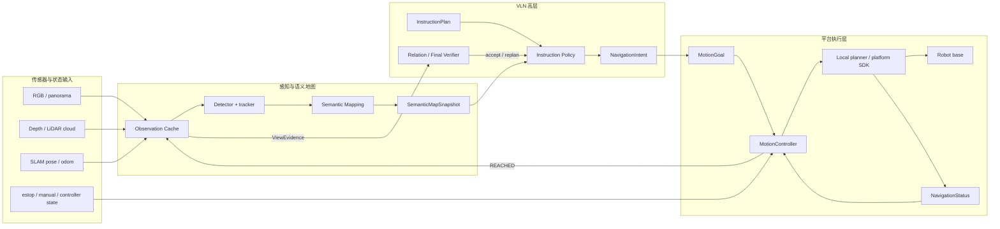
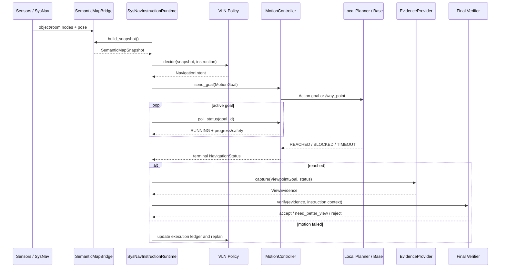

# VLN 实物导航框架与平台适配规范

本文档中的 VLN 是高层语义导航框架名称。现有 `real_robot` ROS 包仍使用
`strive_*` 命名，这是已经发布的 ROS contract，不在本次品牌迁移中改动。

## 1. 文档目的

本文档描述当前 `real_robot` 代码的模块边界、输入输出合同、异步控制流和平台扩展
接口。它面向将 VLN 迁移到不同轮式、全向、四足或其他移动机器人，不绑定某个
具体相机、SLAM、局部规划器或底盘 SDK。

本文使用三种实现状态：

- **已实现**：当前仓库存在代码和离线测试；
- **部分实现**：公共 contract 已存在，但需要平台消息或真机配置；
- **扩展点**：文档定义接口，具体机器人部署时实现。

软件/HIL 通过不等于真机验收。底盘急停、人工接管、传感器时间同步和真实运动反馈
必须在目标机器人上单独验证。

## 2. 架构原则

1. VLN 高层不继承 Habitat Agent，也不输出离散仿真 action。
2. ROS message、Habitat observation 和平台 SDK 不进入平台无关 contract。
3. 高层只输出 `NavigationIntent`，执行层只接收 `MotionGoal`。
4. 物理到达由 motion layer 判断，语义满足由 verifier 判断。
5. VLN 不发布最终 `/cmd_vel`；局部避障、跟踪、限速和急停归底层控制栈。
6. target、anchor、relation edge 的 UID 贯穿规划、执行、证据和 verifier。
7. active goal 执行期间不重复调用高层策略产生新 waypoint。

## 3. 总体数据流



该链路不是单向的“传感器输入、waypoint 输出”。一个可运行的机器人接口必须同时
具备 `NavigationStatus` 反馈，否则 VLN 无法区分 running、reached、blocked、
timeout、safety stop 和 manual takeover。

## 4. 当前模块清单

| 模块 | 状态 | 责任 |
|---|---|---|
| `real_robot/contracts.py` | 已实现 | 平台无关 value objects |
| `real_robot/sysnav_ros_adapters.py` | 已实现 | SysNav detection/object/room/waypoint/status 转换 |
| `real_robot/sysnav_runtime.py` | 已实现 | snapshot、active goal、evidence、verifier 编排 |
| `real_robot/action_motion_controller.py` | 已实现 | `ExecuteWaypoint` ROS Action 客户端 |
| `real_robot/observation_cache.py` | 已实现 | RGB/depth/detection/pose 缓存和 crop evidence |
| `real_robot/detector_vocabulary.py` | 已实现 | detector label/prompt provenance |
| `real_robot/motion_safety.py` | 已实现 | 平台无关速度安全策略 |
| `real_robot/ros2_ws/src/semantic_mapping` | 已实现 | 迁移的 SysNav detector/mapping |
| `real_robot/ros2_ws/src/local_planner` | 已实现 | SysNav 局部规划组件 |
| `real_robot/ros2_ws/src/strive_motion_msgs` | 已实现 | waypoint action 与 safety 消息 |
| `real_robot/ros2_ws/src/strive_sysnav_motion` | 已实现 | action server、alignment、safety mux |
| 相机驱动与同步 profile | 部分实现 | 已有 topic/profile，需绑定目标硬件 |
| LiDAR-camera 投影 | 扩展点 | 依赖标定、相机模型和目标机器人传感器 |
| 机器人专用 MotionController | 扩展点 | 对接 Nav2、厂商 SDK 或其他 planner |
| 真机 runtime bringup | 部分实现 | 需要目标设备 topic/frame/safety 配置 |

`camera_adapter.py`、`depth_projection.py`、`runtime_node.py` 等名称曾出现在规划文档
中，但当前仓库没有这些文件。它们是扩展职责，不应标记为已经实现。

## 5. 平台无关数据合同

### 5.1 观测与语义地图

```python
CameraFrame:
    image_ref              # 图像引用；原始数组由 cache/provider 管理
    camera_model           # panorama / pinhole / unknown
    timestamp
    frame_id
    rgb_shape
    depth_ref
    intrinsics
    extrinsics

RealObservation:
    timestamp
    cameras                # 一个或多个 CameraFrame
    robot_pose             # Pose3D，必须声明 frame_id
    pointcloud_ref
    metadata               # 同步误差、传感器健康等

SemanticMapSnapshot:
    timestamp
    robot_pose
    objects                # ObjectNodeSnapshot，只读运行时对象图
    rooms                  # RoomSnapshot，可为空
    frontiers
    source
```

大图、深度和点云不直接塞进 contract，避免跨进程复制。contract 保存引用、时间戳、
坐标系和标定；具体数组由 ROS cache、共享内存或文件 artifact 管理。

### 5.2 高层意图与运动请求

```python
NavigationIntent:
    mode                   # explore / go_to_object / improve_view / stop ...
    goal_pose
    look_at
    target_object_uid
    anchor_object_uid
    relation_edge_id
    stop_allowed
    reason
    metadata

MotionGoal:
    mode
    goal_pose
    look_at
    target_object_uid
    anchor_object_uid
    relation_edge_id
    tolerance
    reason
    metadata
```

`NavigationIntent` 表达语义理由，`MotionGoal` 表达可执行请求。adapter 可以做 frame
转换、容差映射和 action message 构造，但不能改变 terminal/anchor 角色或自行声明
任务已经完成。

### 5.3 执行状态与视觉证据

```python
NavigationStatus:
    status                 # queued/running/reached/blocked/timeout/...
    goal_id
    current_pose
    distance_to_goal
    path_length_remaining
    progress
    safety_state
    reason_code
    metadata

ViewEvidence:
    source
    timestamp
    pose
    image_ref
    bbox_xyxy
    target_object_uid
    anchor_object_uid
    relation_edge_id
    quality
    verifier_payload
```

只有 `NavigationStatus.succeeded()` 后才能采集 reached-view evidence。blocked、timeout
或 localization lost 不得伪装成 best-available visual evidence。

## 6. 控制流



核心控制逻辑：

```python
snapshot = semantic_map_provider.build_snapshot()

if not readiness.ready:
    return WAIT  # 输入缺失时不调用策略，不发布 waypoint

if active_goal:
    status = motion_controller.poll_status(active_goal.id)
    if not status.is_terminal():
        return TRACK_ACTIVE_GOAL  # 执行期间禁止重复生成目标
    if status.succeeded():
        evidence = evidence_provider.capture(active_goal.viewpoint, status)
        decision = final_verifier.verify(evidence, active_goal.context)
        return apply_verifier_decision(decision)
    return recover_from_motion_failure(status)

intent = instruction_policy.decide(snapshot, instruction)
goal = intent.to_motion_goal()
goal_id = motion_controller.send_goal(goal)
return DISPATCHED(goal_id)
```

这些状态描述的是异步执行生命周期，不包含 `book`、`TV` 等目标规则。目标语义仍由
InstructionPlan、ConceptQuery、runtime grounding 和 verifier 决定。

## 7. 执行器扩展接口

所有机器人执行器实现同一个最小协议：

```python
class MotionControllerProtocol(Protocol):
    def send_goal(self, goal: MotionGoal) -> str:
        """提交目标并返回稳定 goal id。"""

    def poll_status(self, goal_id: str) -> NavigationStatus:
        """返回当前进度、物理到达状态和安全状态。"""

    def cancel(self, goal_id: str | None = None) -> None:
        """取消指定目标；不能把 cancel topic 当成底盘已经停止的证明。"""

    def hold(self) -> None:
        """请求平台安全保持；高层不能自行发布零速度接管底盘。"""
```

推荐实现：

```text
SysNav legacy /way_point  -> RosWaypointController + RosNavigationStatusProvider
VLN ExecuteWaypoint    -> RosActionMotionController
Nav2                      -> Nav2ActionMotionController
Vendor robot SDK          -> VendorActionMotionController
Offline rosbag            -> ReplayMotionController
Unit tests                -> DryRunMotionController
```

新平台优先采用 Action，而不是裸 topic。Action 可以承载 goal ID、feedback、result、
cancel、look-at 和稳定 reason code；`PointStamped /way_point` 需要额外状态 provider
补足这些信息。

平台实现模板：

```python
class VendorActionMotionController(MotionControllerProtocol):
    def send_goal(self, goal: MotionGoal) -> str:
        platform_goal = self.adapter.to_platform_goal(goal)
        # 这里仅转换位姿、容差和 look-at，不改写语义目标身份。
        return self.client.send(platform_goal)

    def poll_status(self, goal_id: str) -> NavigationStatus:
        feedback = self.client.feedback(goal_id)
        # 将厂商状态稳定映射为公共 status/reason_code。
        return self.adapter.to_navigation_status(feedback)

    def cancel(self, goal_id: str | None = None) -> None:
        self.client.cancel(goal_id)

    def hold(self) -> None:
        self.safety_client.request_hold()
```

### 7.1 新平台代码组织模板

平台实现应放在独立包中，不在 `SysNavInstructionRuntime` 内增加机器人型号分支：

```text
real_robot/platforms/<platform_id>/
  profile.yaml                 # topic、frame、容差、watchdog 和能力声明
  observation_adapter.py       # 平台消息 -> RealObservation
  semantic_map_adapter.py      # 可选：平台地图 -> SemanticMapSnapshot
  motion_goal_adapter.py       # MotionGoal -> action/topic/SDK request
  navigation_status_adapter.py # feedback/result -> NavigationStatus
  motion_controller.py         # MotionControllerProtocol 实现
  bringup.launch.py            # 平台节点、remap 和参数装配
  tests/
    test_contract_mapping.py
    test_status_lifecycle.py
    test_cancel_hold.py
```

若平台直接复用 SysNav detector/mapping，则不需要重写
`semantic_map_adapter.py`，只需复用 `SysNavSemanticMapBridge`。不同执行器采用以下边界：

| 执行器类型 | `send_goal` | `poll_status` | `cancel/hold` | 适用条件 |
|---|---|---|---|---|
| ROS2 Action / Nav2 | 发送带 goal id 的 action | 读取 action feedback/result | 使用 action cancel 与安全 hold service | 首选，生命周期完整 |
| SysNav `/way_point` | 发布 `PointStamped` | 独立订阅 planner path/status/odom | 发布 cancel/hold topic，并等待底层确认 | 兼容已有 SysNav |
| 厂商异步 SDK | SDK goal handle | SDK callback 写入线程安全状态缓存 | SDK cancel + 平台急停接口 | SDK 原生支持反馈 |
| 厂商同步 SDK | 后台 worker 执行阻塞调用 | worker 状态 + pose watchdog | 中断 worker 请求并触发安全 hold | 不能阻塞 ROS decision timer |

裸 waypoint topic 本身不是完整 `MotionController`。只有同时具备稳定 goal id、当前目标
关联、进度、到达、阻塞、超时和安全状态来源后，才能适配为公共执行合同。厂商 SDK
也不得直接从回调中调用 final verifier；它只更新 `NavigationStatus`，由 runtime 在下一
个控制周期采集 reached-view evidence。

### 7.2 执行器最小验收合同

每个平台 adapter 至少证明以下状态序列：

```text
send_goal
  -> QUEUED/RUNNING
  -> REACHED | BLOCKED | TIMEOUT | PREEMPTED | SAFETY_STOPPED
```

并满足：

1. 任一时刻只有一个 active goal 拥有运动控制权；
2. `poll_status(goal_id)` 不会把其他目标的反馈关联到当前目标；
3. `REACHED` 同时满足位姿容差、低速度和稳定时间，而不只是 path 消失；
4. `cancel()` 返回后仍需等待 terminal feedback；
5. `hold()` 走平台安全控制链，不由高层直接发布 `/cmd_vel=0`；
6. 重启、通信中断和 stale odom 都映射为显式失败状态，不能保持 RUNNING；
7. status 只证明物理执行结果，最终任务成功仍由 reached-view verifier 决定。

## 8. 传感器与地图扩展接口

不同机器人通常只需替换三类 provider：

```python
class ObservationProvider(Protocol):
    def readiness(self) -> RuntimeReadiness: ...
    def latest_observation(self) -> RealObservation | None: ...

class SemanticMapProvider(Protocol):
    def build_snapshot(self, timestamp: float | None = None) -> SemanticMapSnapshot | None: ...

class EvidenceProvider(Protocol):
    def capture(self, goal: ViewpointGoal, status: NavigationStatus) -> ViewEvidence: ...
```

第一版 SysNav 链路：

```text
/camera/image
  -> detection_node
  -> /detection_result
  -> semantic_mapping_node
  -> /object_nodes_list, /room_nodes_list
  -> SysNavSemanticMapBridge
  -> SemanticMapSnapshot
```

如果替换检测器，保持 `DetectionFrame` 和对象 UID 生命周期合同；词表通过
`DetectorVocabularyAdapter` 提供 provenance，不能在 ROS adapter 内写同义词规则。

如果替换 semantic mapper，只需提供 `SemanticMapSnapshot`。VLN 不应读取新 mapper
的私有内部对象，也不应反向修改其地图。

## 9. 平台 profile

每台机器人使用独立 YAML/env profile，至少声明：

```yaml
platform_id: robot_a
frames:
  world: map
  base: base_link
  camera: camera_link
topics:
  rgb: /camera/image
  depth: /camera/aligned_depth_to_color/image_raw
  pointcloud: /cloud_registered
  odometry: /aft_mapped_to_init
  objects: /huawei_vln/object_nodes_list
  rooms: /huawei_vln/room_nodes_list
motion:
  backend: execute_waypoint_action
  action_name: /strive/execute_waypoint
  xy_tolerance_m: 0.35
  timeout_s: 60.0
safety:
  state_topic: /strive/safety_state
  hold_topic: /strive/hold
  manual_topic: /cmd_vel/manual
  final_velocity_topic: /cmd_vel
sync:
  max_rgb_pose_delta_s: 0.15
  max_cloud_pose_delta_s: 0.20
```

配置只描述平台能力和 topic/frame，不包含 `cup -> table` 等任务语义。

## 10. 安全与故障语义

优先级必须固定：

```text
ESTOP / manual takeover
  > localization lost / stale odom
  > controller fault / stale command
  > no feasible path / blocked / timeout
  > semantic replanning
```

- final `/cmd_vel` 只能由平台安全 mux 发布；
- VLM 超时只能产生 uncertain/wait/replan，不能产生 STOP；
- motion `REACHED` 不能替代语义 verifier；
- verifier `accept` 不能替代物理到达；
- frame mismatch、stale pose、stale image 必须拒绝目标执行或证据采集；
- cancel 后仍要等待底层 hold/safety 状态，不能仅凭消息已发布宣称停止。

## 11. 迁移与验收

### 阶段 A：代码与配置迁移

- 复制 VLN、ROS2 workspace 和平台 profile；
- 编译 ROS packages；
- 检查 message/action type 和 topic ownership；
- 连接独立 LVLM 服务，不在控制容器加载大模型。

### 阶段 B：离线 contract 测试

- Python contract/import 测试；
- fake ROS message adapter 测试；
- MotionGoal/NavigationStatus 状态映射；
- schema fallback 不产生 accept；
- no `/cmd_vel` ownership violation。

### 阶段 C：rosbag 与 HIL

- RGB/LiDAR/odom 时间戳；
- object/room snapshot；
- waypoint action feedback；
- blocked/timeout/cancel/hold；
- reached 后采集 evidence；
- final verifier raw response 和决策写入 artifact。

### 阶段 D：真机验收

- 静态目标与低速短距离 waypoint；
- 局部避障和不可达目标；
- emergency stop 与人工接管；
- 网络中断和 LVLM 超时；
- `find chair`、属性目标、`book on shelf` 等语义任务；
- 保存传感器、intent、motion feedback、evidence、verifier 和安全日志。

当前仓库已经具备平台无关 contract、SysNav 消息适配、两种 motion controller、
status provider 和 reached-view evidence loop。尚不能从软件测试推导真实底盘验收完成；
目标设备的传感器同步、标定、控制器反馈和安全链仍是迁移时必须完成的工作。
