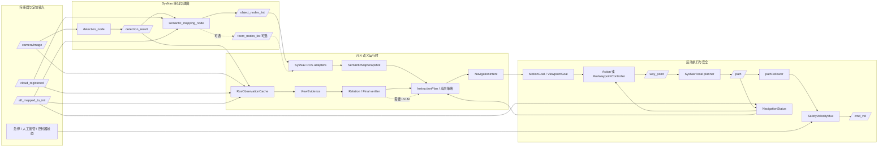
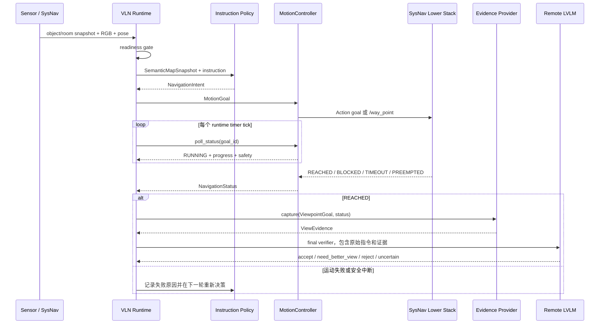

# VLN 实物模式接口与数据流

本文是当前仓库实物模式的唯一接口说明。内容以 `real_robot/` 和其内置 ROS2
workspace 的实际代码为准，描述传感器输入、SysNav 感知建图、VLN 语义决策、运动交接
和证据验证的边界。

本文不把某一台机器人、某一种相机或某个底盘 SDK 写进高层逻辑。真实平台只需要提供
本文定义的输入、反馈和安全合同，即可替换传感器、检测器、局部规划器或底盘执行器。

> LVLM 服务是实物模式的前置依赖，但不属于 ROS 控制链。商业 API 和自部署公网 HTTPS
> 服务的配置见 [`lvlm_server_deployment.md`](lvlm_server_deployment.md)。

## 1. 当前实现边界

当前实物模式采用单一 ROS2 运行环境承载 SysNav 感知建图和 VLN runtime；LVLM 可以部署
在独立 GPU 服务器上，由机器人通过 HTTPS 请求。

```text
机器人 ROS2 环境
  SysNav detector + semantic mapping
  VLN instruction runtime + observation cache + motion adapter

独立 LVLM 服务
  商业 API 或自部署模型服务器
  POST /v1/chat/completions
```

核心所有权如下：

| 层级 | 当前实现 | 负责内容 | 不负责内容 |
|---|---|---|---|
| 传感器与定位 | 机器人驱动、SLAM、Point-LIO 等外部节点 | RGB、点云、位姿和状态发布 | 自然语言语义判断 |
| SysNav 感知建图 | `real_robot/ros2_ws/src/semantic_mapping` | 检测、跟踪、分割、对象融合和对象节点发布 | VLN 任务是否满足 |
| ROS adapter | `real_robot/sysnav_ros_adapters.py` | ROS message 与平台无关 contract 的转换 | 写入 SysNav 地图、硬编码语义 alias |
| VLN runtime | `real_robot/sysnav_runtime.py`、`instruction_runtime_node.py` | snapshot、指令策略、活动目标、证据和 verifier 编排 | 直接发布 `/cmd_vel` |
| LVLM | 远程 HTTP 服务 | 指令解析、概念 grounding、关系和最终视觉判断 | 物理可达性、速度控制、急停 |
| SysNav motion stack | local planner、path follower、安全 mux | waypoint 执行、避障、跟踪、限速、急停和 `/cmd_vel` | 自然语言任务成功 |

当前已经有平台无关 Python contract 和 SysNav adapter；真实传感器、目标底盘和急停链
仍需要在对应设备上验收。代码 smoke、ROS bag replay 和 HIL 不能代替实物运动验收。

截至 2026-08-21，Orin-26 上已经验证 D435i、MID-360/Point-LIO、detector、semantic
mapping 到真实对象节点的数据链，以及 `/way_point` 到影子 `Float32MultiArray` topic 的
waypoint 格式转换。当前投影配置仍为 `extrinsics_only`，controller contract 仍为
`unapproved`，因此这些结果属于数据层和影子控制验证，不是完整实物导航验收。唯一执行
清单见 [`real_robot_deployment_todo.md`](real_robot_deployment_todo.md)。

## 2. 总体架构



图中的箭头表示数据或状态边界，不表示所有节点必须由本仓库启动。当前 launch 通过
参数和 remap 接入具体机器人 topic。

## 3. 输入接口

### 3.1 传感器与定位

| 输入 | 默认 topic | ROS 类型 | 消费方 | 作用 |
|---|---|---|---|---|
| RGB | `/camera/image` | `sensor_msgs/Image` | detector、runtime cache | 目标检测、房间语义和最终证据 |
| 注册点云 | `/cloud_registered` | `sensor_msgs/PointCloud2` | semantic mapping、可选 cache | 三维对象融合和局部几何 |
| 位姿 | `/aft_mapped_to_init` | `nav_msgs/Odometry` | runtime、status provider | 当前机器人位姿和运动进度 |
| 路径 | `/path` | `nav_msgs/Path` | status provider | 局部规划路径和剩余进度 |
| 规划器状态 | `/local_planner/status` | `std_msgs/String` | status provider，可选 | blocked、running 等状态补充 |
| 对齐深度 | 参数指定 | `sensor_msgs/Image` | observation cache，可选 | RealSense 或点云投影的局部深度 |

实际 SysNav semantic mapping 内部使用的 topic 可以是 `/registered_scan` 和
`/state_estimation`，由 `sysnav_detection_mapping.launch.py` 将机器人 profile 中的
`cloud_topic`、`odom_topic` 映射进去。上层 runtime 使用统一的 `/cloud_registered`、
`/aft_mapped_to_init` 默认值，迁移时通过 launch 参数修改，不修改 Python 逻辑。

传感器合同至少需要：

```text
RGB、点云和位姿具有可比较的时间戳；
位姿声明 frame_id，目标位置和 waypoint 使用同一 world frame；
图像引用可被 observation cache 或 evidence provider 读取；
定位失效、数据过期和 frame 不一致能够被显式检测。
```

Ricoh Theta Z1 可以作为全景 RGB 输入，RealSense 可以作为 pinhole RGB-D 输入。上层
只读取 `CameraModel.PANORAMA` 或 `CameraModel.PINHOLE`，不依赖相机品牌。LiDAR 点云
可以通过平台 adapter 投影为稀疏深度，但稀疏深度中的未知像素必须保留为 unknown，
不能伪装成 Habitat 的稠密深度。

### 3.2 SysNav 感知与地图 topic

```text
/camera/image
  -> detection_node
  -> /detection_result
  -> semantic_mapping_node
  -> /object_nodes_list
  -> RosObjectNodeAdapter
  -> SemanticMapSnapshot
```

当前迁移的 `semantic_mapping_node.py` 明确发布 `/object_nodes_list`。`room_nodes_list`
是 adapter 和 runtime 支持的兼容输入，可由外部 SysNav 房间节点或后续房间语义节点
提供；当前文档不把它假设为每台机器人必然存在的输出。

检测器词表由 SysNav `objects.yaml` 提供给
`DetectorVocabularyAdapter`。adapter 只保存 detector label、prompt 和 provenance，
不在 ROS 层把 `shelf`、`bookshelf` 等自然语言概念写成别名规则；概念 grounding 由
VLN instruction/concept 模块完成。

### 3.3 任务与 LVLM 输入

实物任务指令通过 runtime 参数进入：

```text
instruction
dataset_target 可选
instruction_plan_backend
vlm
```

在 `semantic_snapshot`、`instruction` 或 `instruction_plan` policy 模式下，runtime
把原始指令交给现有 instruction compiler。需要 LLM 时，客户端按
[`lvlm_server_deployment.md`](lvlm_server_deployment.md) 访问商业 API 或远程自部署 LVLM。

LVLM 请求只包含指令、候选对象、地图/几何事实、关系证据和图像引用；模型服务不订阅
ROS topic，也不访问 `/cmd_vel`、`/way_point` 或底盘 SDK。

## 4. 平台无关数据合同

`real_robot/contracts.py` 是实物模式的稳定边界，不导入 ROS、Habitat、检测器或某个
机器人 SDK。

### 4.1 观测与地图

```python
CameraFrame:
    image_ref                  # 原始图像由 cache/provider 管理
    camera_model               # panorama / pinhole / unknown
    timestamp
    frame_id
    rgb_shape
    depth_ref
    depth_valid_mask_ref
    intrinsics
    extrinsics
    fov

RealObservation:
    timestamp
    robot_pose                 # Pose3D，必须声明 frame_id
    camera_frames
    pointcloud_ref
    pointcloud_frame_id
    odom_frame_id
    metadata

DetectionFrame:
    timestamp
    image_ref
    boxes_xyxy
    labels
    confidences
    track_ids
    masks_ref
    source
    metadata

ObjectNodeSnapshot:
    uid                         # SysNav object id 的稳定包装
    label
    position
    confidence
    bbox2d_xyxy
    bbox3d_center / bbox3d_extent
    room_id
    image_ref / pointcloud_ref
    visible_viewpoints
    track_ids
    verified_state

RoomSnapshot:
    uid
    label                       # SysNav room 没有语义名时可以为空
    centroid
    neighbors / objects / frontiers
    image_ref
    explored

SemanticMapSnapshot:
    timestamp
    robot_pose
    objects
    rooms
    viewpoints
    frontiers
    source
    metadata
```

大图、点云和深度不直接复制进 map contract。contract 保存引用、时间戳、坐标系和
标定信息；`RosObservationCache` 和 `ObjectCropEvidenceProvider` 负责图像缓存、裁剪
和证据路径。

### 4.2 语义意图与运动请求

```python
NavigationIntent:
    mode                       # explore / go_to_object / improve_view / stop / wait
    goal_pose
    target_object_uid
    anchor_object_uid
    relation_edge_id
    stop_allowed
    priority
    reason
    metadata

MotionGoal:
    mode
    goal_pose
    look_at
    target_object_uid
    anchor_object_uid
    relation_edge_id
    tolerance
    reason
    metadata

ViewpointGoal:
    pose
    purpose                    # verify_target / verify_relation / improve_view
    look_at
    target_object_uid
    anchor_object_uid
    relation_edge_id
    evidence_requirements
    tolerance
```

`NavigationIntent` 是高层语义决策，`MotionGoal` 是执行层请求，`ViewpointGoal` 是需要
在到达后采集证据的运动目标。adapter 可以转换坐标系、容差和 ROS message，但不能
改变 target/anchor UID、relation edge 或 `stop_allowed` 的语义。

### 4.3 执行状态与证据

```python
NavigationStatus:
    status                     # queued / running / reached / blocked / timeout / ...
    goal_id
    current_pose
    distance_to_goal
    path_length_remaining
    progress
    reason_code
    safety_state
    current_velocity
    metadata

ViewEvidence:
    source
    timestamp
    pose
    image_ref
    camera_model
    bbox_xyxy
    target_object_uid
    anchor_object_uid
    relation_edge_id
    quality
    verifier_payload
    metadata

RuntimeDecision:
    timestamp
    intent
    motion_goal
    navigation_status
    accepted_candidate_uid
    accepted_relation_edge_id
    verifier_decision
    lower_planner_state
    reason
    metadata
```

`NavigationStatus.REACHED` 只代表物理 motion goal 到达；它不等于自然语言任务成功。
`ViewEvidence` 只有在运动层确认到达后才允许进入 final verifier。`RuntimeDecision` 会
由 `RuntimeDecisionJsonlWriter` 写入运行目录，作为控制流复盘记录。

## 5. 控制流

实物模式不是 Habitat 的同步 `env.step(action)`。机器人运动是异步过程：发送 goal、
等待底层反馈、采集当前证据，再决定停止或继续。



对应当前 `SysNavInstructionRuntime.step()` 的最小伪代码如下：

```python
def step(instruction):
    readiness = readiness_provider()
    if not readiness.ready:
        return WAIT  # 输入未齐时不调用策略，也不发送运动目标

    snapshot = semantic_map_bridge.build_snapshot()
    if snapshot is None:
        return WAIT  # 没有对象图时不把空地图交给导航策略

    active = state.poll_active(motion_controller)
    if active is not None:
        if not active.status.is_terminal():
            return TRACK_ACTIVE_GOAL  # active goal 未结束时禁止反复发布 waypoint
        if active.status.succeeded():
            evidence = evidence_loop.verify_reached(active.goal, active.status)
            return APPLY_VERIFIER_DECISION(evidence)
        return HANDLE_MOTION_FAILURE(active.status)

    intent = policy.decide(snapshot, instruction)
    if intent.mode == WAIT:
        return WAIT

    goal_id = motion_controller.send_goal(intent.to_motion_goal())
    state.bind_active(goal_id, intent, intent.to_motion_goal())
    return DISPATCHED(goal_id)
```

这里的 `APPLY_VERIFIER_DECISION` 只允许 final verifier 在语义、关系和视觉证据满足时
生成 `STOP`；`REACHED` 本身不能授权 STOP。若 VLM 返回 `need_better_view`，上层策略
应保留 target/anchor/relation 上下文并生成下一个 `ViewpointGoal`，而不是把运动失败
伪装成任务完成。

## 6. 输出接口与所有权

### 6.1 VLN 内部输出

| 输出 | 类型 | 下游 | 说明 |
|---|---|---|---|
| 语义意图 | `NavigationIntent` | runtime | 表达目标对象、anchor、关系和原因 |
| 运动请求 | `MotionGoal` | motion controller | 表达可执行位姿和容差 |
| 视角请求 | `ViewpointGoal` | motion controller/evidence | 到达后需要采集视觉证据 |
| 证据 | `ViewEvidence` | relation/final verifier | 绑定 pose、图像、bbox 和 UID |
| 决策记录 | `RuntimeDecision` | JSONL artifact | 记录一次控制周期的输入摘要和输出 |

### 6.2 ROS 输出

VLN runtime 支持两种互斥的高层运动后端：

```text
方式 A：Action backend
  MotionGoal
    -> RosActionMotionController
    -> /strive/execute_waypoint
    -> SysNavMotionServer
    -> /way_point

方式 B：Waypoint backend
  MotionGoal
    -> RosWaypointController
    -> geometry_msgs/PointStamped on /way_point
```

两种后端不能同时成为 `/way_point` owner。Action backend 适合承载 goal id、feedback、
result、cancel 和 safety reason；Waypoint backend 兼容现有 SysNav 原生 topic，但必须
依赖 `RosNavigationStatusProvider` 从 odom、path、timeout 和 progress 推断状态。

`/way_point` 之后存在两条互斥的下层执行路径。SysNav 原生路径为：

```text
/way_point
  -> SysNav local planner
  -> /path
  -> path follower
  -> /cmd_vel/autonomy
  -> SafetyVelocityMux
  -> /cmd_vel
```

Orin-26 当前观察到的机器人自有路径为：

```text
/way_point (geometry_msgs/PointStamped, world frame)
  -> WaypointFormatAdapter
  -> /waypoint (std_msgs/Float32MultiArray, ego [x, y])
  -> 外部局部规划器 / PD controller
  -> 外部底盘 bridge / mux
```

第二条路径目前只完成影子 topic 验证，尚未连接真实 `/waypoint`。两条下层路径不能同时
启动；在真实 controller contract 获批前，迁移的 SysNav `pathFollower` 和机器人外部
controller 都不得取得生产 `/cmd_vel` 所有权。

`/cmd_vel` 只能由底层安全 mux 发布。VLN、instruction runtime、LVLM 和 evidence
provider 都不得直接发布 `/cmd_vel` 或其变体。

### 6.3 安全信号

安全 topic 由平台 profile 注入，当前 launch 支持：

```text
hold_topic             例如 /platform/safe_hold
cancel_topic           例如 /local_planner/cancel
emergency_stop_topic   默认关闭，需显式允许
manual takeover        由底盘安全链处理
```

`dry_run=true` 是默认安全模式，不创建真实 waypoint 交接；需要测试 waypoint 时应
使用独立的 `test_waypoint_topic`，不能把测试 topic 指向 `/cmd_vel`。真实 waypoint
交接必须满足：

```text
dry_run=false
lower_controller_enabled=true
controller_contract_file 已配置且 approval_status=approved
waypoint、frame、feedback、速度限制和急停字段全部通过校验
```

## 7. 实物模块与适配接口

### 7.1 已实现模块

```text
real_robot/contracts.py
  平台无关的观测、地图、意图、运动、状态和证据合同。

real_robot/detector_vocabulary.py
  读取 SysNav objects.yaml，保存 detector label/prompt provenance。

real_robot/sysnav_ros_adapters.py
  RosDetectionResultAdapter
  RosObjectNodeAdapter
  RosRoomNodeAdapter
  RosNavigationStatusProvider
  RosWaypointController

real_robot/observation_cache.py
  RGB、depth、pointcloud、pose、detection 缓存和目标 crop evidence。

real_robot/sysnav_runtime.py
  SysNavSemanticMapBridge
  SysNavInstructionRuntime
  ViewpointEvidenceLoop
  RuntimeDecisionJsonlWriter

real_robot/action_motion_controller.py
  ExecuteWaypoint Action client；通过 SysNavMotionServer 交接 waypoint。

real_robot/waypoint_adapter.py
  将 world-frame PointStamped 转换为机器人自有 controller 的 ego-frame 数组；只负责
  frame、时间和格式转换，不发布速度。

real_robot/motion_safety.py
  平台无关速度限制和安全决策模型。

real_robot/control/controller_contract.py
  校验 waypoint、反馈、速度限制、watchdog、急停和人工接管合同。
```

ROS2 workspace 中与当前链路相关的包：

```text
real_robot/ros2_ws/src/semantic_mapping
  detector_node.py
  semantic_mapping_node.py

real_robot/ros2_ws/src/strive_sysnav_bringup
  sysnav_detection_mapping.launch.py
  strive_instruction_runtime.launch.py
  strive_real_robot_stack.launch.py
  waypoint_adapter.launch.py
  instruction_runtime_node.py
  waypoint_adapter_node.py

real_robot/ros2_ws/src/strive_motion_msgs
  ExecuteWaypoint.action
  SafetyState.msg
```

`ros2_ws/build`、`install` 和 `log` 是编译产物，不是接口源码，也不应作为迁移依据。

### 7.2 平台扩展协议

替换硬件时，优先实现以下三个边界，而不是在 `SysNavInstructionRuntime` 中添加平台
分支：

```python
class ObservationProvider(Protocol):
    def latest_observation(self) -> RealObservation | None: ...

class SemanticMapProvider(Protocol):
    def build_snapshot(self, timestamp: float | None = None): ...

class MotionControllerProtocol(Protocol):
    def send_goal(self, goal: MotionGoal) -> str: ...
    def poll_status(self, goal_id: str) -> NavigationStatus: ...
    def cancel(self, goal_id: str | None = None) -> None: ...
    def hold(self) -> None: ...
```

推荐的平台目录结构：

```text
real_robot/platforms/<platform_id>/
  profile.yaml
  observation_adapter.py
  semantic_map_adapter.py       # 复用 SysNav 时可以省略
  motion_goal_adapter.py
  navigation_status_adapter.py
  motion_controller.py
  bringup.launch.py
  tests/
```

如果继续使用 SysNav detector 和 semantic mapping，只需保证：

```text
平台传感器 -> SysNav 输入 topic
SysNav 输出 /object_nodes_list -> RosObjectNodeAdapter
VLN MotionGoal -> SysNav waypoint/action 接口
SysNav odom/path/status -> NavigationStatus
```

检测器可以替换，但必须继续输出 `DetectionFrame` 或兼容 SysNav 的
`DetectionResult`，并保留稳定的 track/object identity 和 label provenance。

## 8. 运行模式

### 8.1 等待模式

```text
policy_mode=wait
```

只验证 ROS 输入和 runtime readiness，不编译或调用自然语言策略，不发布 waypoint。

### 8.2 first-object smoke

```text
policy_mode=first_object_smoke
```

只用于验证 snapshot 到 motion bridge 的连通性，选择第一个有三维位置的对象，不解释
自然语言，也不代表 ObjectNav 能力。

### 8.3 语义指令模式

```text
policy_mode=semantic_snapshot
instruction="find a book on a shelf"
instruction_plan_backend=llm
enable_final_verifier=true
```

该模式才会编译 `InstructionPlan`，运行概念 grounding、关系约束、视角证据和 final
verifier。若启用 `llm` backend，机器人必须配置 LVLM HTTP 服务。

### 8.4 motion 安全开关

```text
dry_run=true
  记录 RuntimeDecision，不发布真实 /way_point。

dry_run=false, lower_controller_enabled=false
  只允许显式配置的 test waypoint，不能连接真实底盘。

dry_run=false, lower_controller_enabled=true
  需要通过 controller contract，才允许交给真实下层控制器。
```

## 9. 接口验收范围

当前仓库可以进行：

- Python contract、ROS adapter、runtime 状态生命周期和安全 topic 校验；
- fake ROS message / dry-run / bag replay；
- SysNav detector、semantic mapping、VLN runtime 的 ROS graph smoke；
- 远程 LVLM 的 HTTP 和结构化 schema smoke。

以下内容不由本仓库离线测试替代：

- 真实相机、Livox、SLAM 的时间同步与 frame 标定；
- 真实 `/way_point` 到底盘的路径跟踪和到达反馈；
- 速度、角速度、加速度限制的实测；
- 急停、人工接管、通信中断和底盘故障；
- 目标机器人上的最终导航成功率。

真机验收应从 `dry_run` 开始，依次经过 test waypoint、低速短距离、受控场地，再启用
真实 lower controller。任何阶段都不得绕过 controller contract 或直接增加 VLN 的
`/cmd_vel` publisher。

## 10. 相关文档

- [实物部署状态与 TODO](real_robot_deployment_todo.md)
- [实物控制链原理与当前方案](real_robot_control_chain_design_zh.md)
- [LVLM 接入与部署基础](lvlm_server_deployment.md)
- [SysNav 真实机器人 ROS2 workspace](../real_robot/ros2_ws/README.md)
- [技术白皮书](project_technical_whitepaper.md)
- [文档与运行产物目录约定](README.md)
