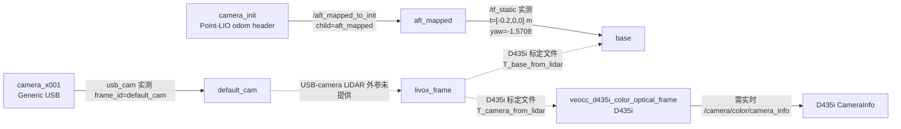

# Orin-26 实物 TF 转换图与证据表

生成时间：2026-08-12（第二次实时采样）。本文区分“实时 ROS TF”与“标定文件中的静态变换”。
没有在 `/tf` 或 `/tf_static` 观察到的关系，不会被伪造为实时 TF。

## 当前图（按传感器链路分开）



实线表示当前采样或消息头直接支持的关系；虚线表示配置/标定文件中的关系或尚未验证的关系。
`camera_init` 是 Point-LIO 的里程计消息 frame，不等价于已经存在的 TF frame。

## 转换表

| 起点 → 终点 | 数值/语义 | 来源 | 当前状态 |
|---|---|---|---|
| `livox_frame → veocc_d435i_color_optical_frame` | `t=[0.10970761, 0.67284314, 0.27480904] m`；ZYX RPY=`[-1.935569001, 0.007663065, -3.131491315] rad` | `T_camera_from_lidar`，D435i 标定 JSON | 已导入配置；不是 USB-camera 外参 |
| `livox_frame → base` | `t=[0.023289306, 0.189000086, 0.04412] m`；旋转约 Z=`π/2` | `T_base_from_lidar`，D435i 标定 JSON | 文件关系；当前实时 TF 链路未包含该静态标定 |
| `camera_init → aft_mapped` | 实时 TF 与 odometry 均出现；位置随定位更新 | `/tf`、`/aft_mapped_to_init` 实际消息 | 已观察 |
| `aft_mapped → base` | `t=[-0.2,0,0] m`；yaw=`-1.5708 rad` | `/tf_static` 实际消息；与原有启动脚本一致 | 已观察 |
| `camera_x001 → default_cam` | `usb_cam` 实测图像 `frame_id=default_cam` | 隔离相机冒烟 | 已观察 |
| `livox_frame → default_cam` | 未提供 | 不适用 | USB-camera 外参待标定，保持零占位且不可用于融合 |
| RGB → LiDAR 时间偏移 | `rgb_minus_lidar_time_offset_s=0.0` | D435i JSON 未包含时间偏移 | 明确标为 `assumed_zero_unvalidated`，不是实测值 |

## 采样证据

本次只读命令观察到 `/tf` 动态样本 `camera_init → aft_mapped`，`/tf_static` 样本
`aft_mapped → base`；另有已有项目的 `world → depth_camera` 动态 TF。`camera_init`、
`aft_mapped`、`base` 的链路现在可查询，但 `default_cam` 和 D435i optical frame 仍没有可查询 TF。
因此不发布任何补偿静态 TF，也不把标定 JSON 当成实时 TF 广播。

USB-camera 隔离测试：`usb_cam` 使用 `pixel_format=mjpeg2rgb` 成功打开 `/dev/video0` 的
1920×1080 MJPEG 模式，图像 `frame_id=default_cam`、编码 `rgb8`，实测约 24.9 Hz，并发布 `/camera_info`；`CameraInfo` 的
`width/height=1920/1080`、`distortion_model=radial_3`、
`K=[749.2058,0,1003.1,0,749.2058,526.5258,0,0,1]` 与用户文件一致。
设备声明该模式为 30 Hz；USB-camera 的内参接入已通过；它仍没有 LiDAR 外参。

## 后续验证命令

```bash
# 只读；不会发布控制指令
ros2 topic echo --once /tf
ros2 topic echo --once /tf_static
ros2 run tf2_ros tf2_echo <parent_frame> <child_frame>
```

D435i 启用后，应先读取 `/camera/color/camera_info` 的实时内参/畸变和消息 frame，再将其填入
`real_robot/ros2_ws/src/semantic_mapping/config/projection_orin26_d435i_mid360.yaml`；完成 RGB-LiDAR 时间相关性测量后，
才可以把 `calibration_status` 从 `extrinsics_only` 提升为 `calibrated`。
